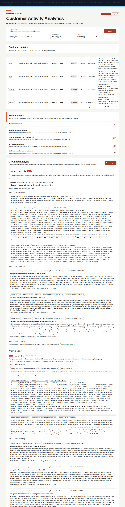
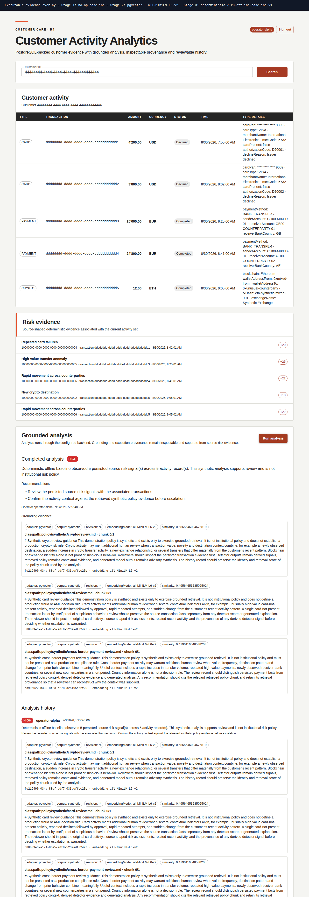
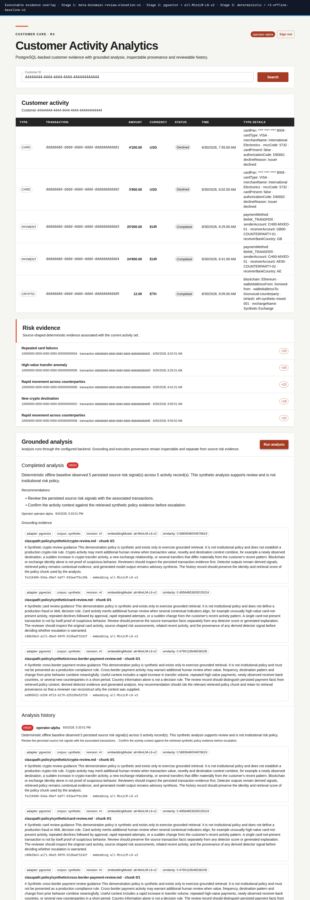

# Customer Activity Analytics

[](https://github.com/jdoe-dev-159753/specgraph-reference-app/actions/workflows/application-ci.yml)
[](https://github.com/jdoe-dev-159753/specgraph-reference-app/actions/workflows/demo-images.yml)
[](https://github.com/jdoe-dev-159753/specgraph-reference-app/actions/workflows/work-graph-guard.yml)
[](backend/pom.xml)
[](docker/app.Dockerfile)
[](backend/pom.xml)
[](backend/pom.xml)
[](backend/pom.xml)
[](compose.yaml)
[](compose.r4.yaml)
[](docker/app.Dockerfile)
[](frontend/package.json)
[](frontend/package.json)
[](frontend/package.json)
[](e2e/package.json)
<!-- repository-metrics-badge:start -->
[](docs/reviewer/repository-metrics.md)
<!-- repository-metrics-badge:end -->

Customer Activity Analytics is a runnable customer-care application for reviewing customer activity, risk evidence, applicable policy and retained analysis history. It demonstrates how a specification-driven delivery can combine deterministic controls, statistical detectors, local retrieval and optional language-model adapters without letting generated text replace source evidence.

The demo data is synthetic. Detector scores are reviewer signals for this bounded scenario; they are not calibrated production AML probabilities and do not assert wrongdoing.

## Start here

| What | Link |
| --- | --- |
| **R5 interview demonstrator** | [Run the full local-model demo](#docker-quickstart) |
| R5 implementation guide | [Open the reviewer guide](docs/reviewer/r5-runtime.md) |
| R4 comparison fallback | [Open the retained R4 gallery](docs/reviewer/r4-gallery.md) |
| J5 immutable submission | [Track the final release](https://github.com/jdoe-dev-159753/specgraph-reference-app/issues/127) |

R5 is the one full interview configuration: authenticated customer review, Bayesian + fuzzy + Random Forest Stage-1 evidence, PostgreSQL/pgvector grounding, and advisory synthesis by the local Ministral model in LM Studio. It is a dense one-week demonstrator, not a production AML platform.

## Docker quickstart

Prerequisites: LM Studio on Windows, Docker Compose 2.34+ on `watch-infra-01`, and read access to the repository's private GHCR packages. In LM Studio, set **Context Length** to `8192` for `ministral-3-8b-instruct-2512`, reload the model, enable **Serve on Local Network**, and open **Developer > Logs**. The densest R5 request is conservatively estimated at 4,163 tokens including its 512-token output reserve, leaving comfortable headroom.

From `watch-infra-01`, copy and run this block. The first command proves the VPS-to-LM-Studio route before Docker starts anything:

```bash
docker login ghcr.io -u jdoe-dev-159753
curl -fsS http://10.77.0.1:1234/v1/models
export SPECGRAPH_LOCAL_BASE_URL=http://10.77.0.1:1234/v1
export SPECGRAPH_LOCAL_MODEL=ministral-3-8b-instruct-2512
export R5_BIND_ADDRESS=10.77.0.31
export R5_PORT=8088
docker compose -p specgraph-r5 \
  -f oci://ghcr.io/jdoe-dev-159753/specgraph-reference-app-compose:r5-95291221c48e15010cbcf600bfa84ee087d54f6d \
  up -d --wait --no-build --pull always
docker compose -p specgraph-r5 \
  -f oci://ghcr.io/jdoe-dev-159753/specgraph-reference-app-compose:r5-95291221c48e15010cbcf600bfa84ee087d54f6d ps
```

This immutable candidate was proven and published by the successful R5 workflow. The shorter `:r5` tag is promoted only after merge to `main`.

If the VPS cannot route `10.77.0.1`, retry the route check with the LM Studio address reported by Windows, currently `169.254.123.79`, and use that same address in `SPECGRAPH_LOCAL_BASE_URL`. Do not continue until `/v1/models` returns the Ministral model.

Open [http://10.77.0.31:8088/](http://10.77.0.31:8088/), then sign in with either repository-owned demo account:

| Operator | Password |
| --- | --- |
| `operator-alpha` | `alpha-demo-2026` |
| `operator-beta` | `beta-demo-2026` |

Search for customer `44444444-4444-4444-4444-444444444444` and select **Run analysis**. LM Studio Developer Logs must show the OpenAI-compatible request; the browser must then show the generated analysis, all three detector artifacts, pgvector grounding, `backend: local`, the Ministral model identity, and `external transmission: no`. Reload the page to confirm retained history.

Stop and reset the R5 demo with the same OCI Compose package:

```bash
docker compose -p specgraph-r5 \
  -f oci://ghcr.io/jdoe-dev-159753/specgraph-reference-app-compose:r5-95291221c48e15010cbcf600bfa84ee087d54f6d \
  down -v
```

From a repository checkout, `./scripts/r5-runtime-up.sh` is the stricter alternative: it invokes the same Compose topology, pulls the registered R5 image by default, and performs the model, login, analysis and provenance preflights before printing the reviewer URL. Set `R5_SOURCE_BUILD=true` only when deliberately rebuilding from source.

## Screenshot fallback

These unedited screenshots were promoted from successful browser-validation artifacts. They keep the interface and evidence story reviewable if the live model or network is unavailable during the interview.

### R5 full composite with local-model provenance



This unedited capture comes from the exact workflow that published the immutable WatchInfra candidate above. Its Stage-3 endpoint is the deterministic LM Studio contract double; the manual WatchInfra rehearsal proves the same candidate against the real LM Studio process and Developer Logs.

### R4 deterministic baseline



### R4 Bayesian detector



## What the reviewer is seeing

The application keeps four authorities distinct:

1. persisted CARD, PAYMENT and CRYPTO activity plus source risk assessments;
2. three separately retained detector artifacts from Bayesian, fuzzy and Random Forest mechanisms;
3. relevant policy evidence retrieved from PostgreSQL/pgvector with local MiniLM embeddings;
4. structured advisory synthesis, selected explicitly as deterministic, local LM Studio or external OpenAI.

Only bounded, citable evidence crosses the model boundary. The deterministic backend is the no-credential default; provider credentials configure an adapter but never select it implicitly.

LM Studio is selected explicitly through `SPECGRAPH_ANALYSIS_BACKEND=local`; its base URL must use a loopback, private, link-local or ULA IP literal rather than a hostname. The R5 Compose package fixes the detector selection and local-model backend while keeping generated output advisory.


The runtime is one modular monolith with hexagonal boundaries. HTTP/UI, relational persistence, detectors, retrieval and model providers remain adapters behind application-owned ports. R5 extends evidence and capability maturity without creating another runtime stack.

## Evidence

- [R5 copy/paste Docker commands and evidence boundaries](docs/reviewer/r5-runtime.md)
- [R4 fallback gallery](docs/reviewer/r4-gallery.md)
- [Authentic screenshot provenance](docs/reviewer/screenshot-manifest.md)
- [Architecture figures and controlled sources](docs/reviewer/architecture-figures.md)
- [Application CI runs](https://github.com/jdoe-dev-159753/specgraph-reference-app/actions/workflows/application-ci.yml)
- [Published-image and remote-pull proof](https://github.com/jdoe-dev-159753/specgraph-reference-app/actions/workflows/demo-images.yml)
- [Configuration-sensitive R4 browser evidence](https://github.com/jdoe-dev-159753/specgraph-reference-app/actions/workflows/r4-gallery-ci.yml)
- [R5 registered image and browser evidence](https://github.com/jdoe-dev-159753/specgraph-reference-app/actions/workflows/r5-release.yml)

## Engineering documents

- [SRS — requirements and acceptance semantics](docs/assignment/SRS/SRS.md)
- [SDD — architecture, modules and trust boundaries](docs/assignment/SDD/SDD.md)
- [Architecture decisions](docs/assignment/ADR/), including the [public product identity and final-freeze boundary](docs/assignment/ADR/ADR-008-customer-activity-analytics-identity.md)
- [V&V — verification strategy and evidence model](docs/assignment/VV/VV.md)
- [OpenAPI — deployed HTTP contract](backend/src/main/resources/static/openapi.yaml)
- [Proprietary evaluation license](LICENSE)

PlantUML sources beside the rendered SVGs are authoritative. GitHub issues, pull requests, checks and exact-SHA artifacts own delivery state; this README stays a concise entry point rather than duplicating those records.
