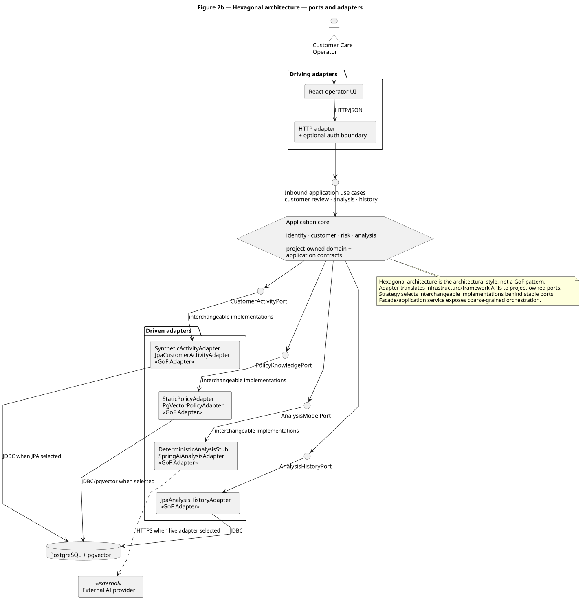
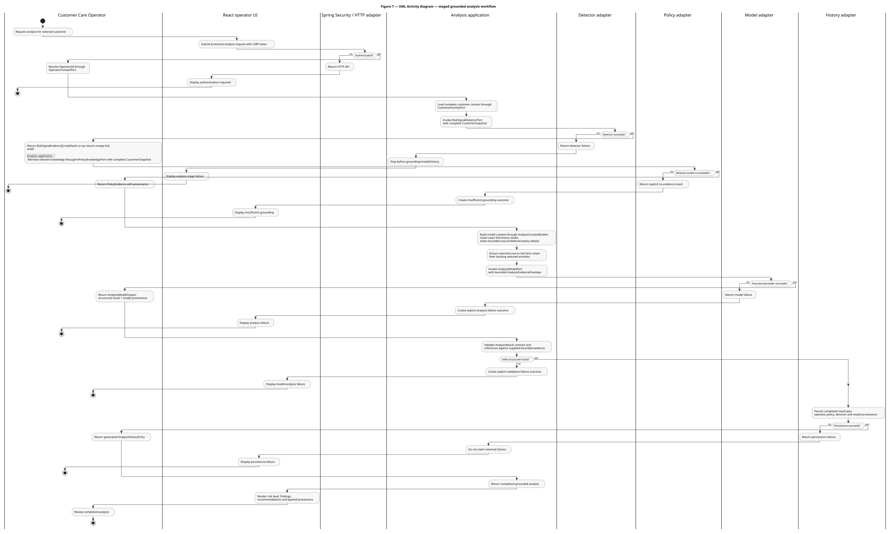

# Customer Activity Analytics - SpecGraph Reference App

[](https://github.com/jdoe-dev-159753/specgraph-reference-app/actions/workflows/application-ci.yml)
[](https://github.com/jdoe-dev-159753/specgraph-reference-app/actions/workflows/demo-images.yml)
[](https://github.com/jdoe-dev-159753/specgraph-reference-app/actions/workflows/work-graph-guard.yml)


**A runnable reference application for specification-driven, AI-assisted software engineering.**

The application lets a Customer Care operator inspect deterministic CARD, PAYMENT and CRYPTO activity plus persisted source-shaped risk evidence. R2 replaces the synthetic activity adapter with PostgreSQL/Flyway persistence behind the same project-owned `CustomerActivityPort`. R3 adds structured analysis and persistent reviewable history behind provider-neutral ports. R4 adds multi-operator authentication, real policy retrieval through PostgreSQL/pgvector with local `all-MiniLM-L6-v2` embeddings, explicit detector evidence, grounding validation and interchangeable Stage-3 synthesis behind `AnalysisModelPort`.

The runtime is a **modular monolith with hexagonal / ports-and-adapters boundaries**. Vendor and algorithm names are adapter identities, not architecture-layer names.

## Current delivery status

- **J4 / R4 delivered foundation:** the same application can run as the R4 baseline or with the Bayesian Stage-1 detector while retaining PostgreSQL/pgvector grounding, local MiniLM embeddings, authentication and deterministic Stage-3 synthesis.
- **R5 final candidate:** the current R5 delivery scope is directly accessible through [#398](https://github.com/jdoe-dev-159753/specgraph-reference-app/issues/398). It aggregates the already delivered rings plus the remaining detector-ceiling, optional classical-ML lifecycle/benchmark and reviewer-evidence work; it does not rebuild those capabilities in a second stack.
- **Topology simplification:** R5 reuses the same modular monolith, application-owned ports, Compose shape and orthogonal detector/model configuration. It does not create a new runtime port or rename configured R4 variants into artificial R5/R6/R7 services.
- **Scope control:** the controlled design classifies classical-ML differentiation as `NICE_TO_HAVE`. [#128](https://github.com/jdoe-dev-159753/specgraph-reference-app/issues/128) keeps the dataset ceiling and comparison decision explicit; Random Forest, local/external synthesis and late-fusion variants may be retained with bounded evidence or explicitly excluded/replanned instead of being rushed into the frozen candidate.
- **Final publication:** R5 names capability maturity; J5 is the independent freeze/review/demo timebox. The final criteria in [#127](https://github.com/jdoe-dev-159753/specgraph-reference-app/issues/127) require the immutable `submission-v1` tag and its clickable GitHub Release/manifeste to resolve to the reviewed exact SHA.

## Reviewer at a glance

The mature analysis path is intentionally split by function:

1. **Stage 1: primitive signal analysis** behind `RiskSignalDetectorPort`, currently no-op by default or Bayesian when selected;
2. **Stage 2: evidence grounding and fusion** through `PolicyKnowledgePort`, real pgvector retrieval and local MiniLM embeddings, assembled into the application-owned `AnalysisEvidenceEnvelope`;
3. **Stage 3: final advisory synthesis** behind `AnalysisModelPort`, deterministic by default and externally substitutable only through deliberate opt-in configuration.

Source `risk_assessments`, detector-derived `RiskSignalEvidence`, retrieved `PolicyEvidence` and generated analysis remain separate semantic authorities throughout the pipeline.

### Hexagonal architecture



### Grounded analysis workflow



The PlantUML sources beside these SVGs remain the controlled design authority. See the [SDD](docs/assignment/SDD/SDD.md) for the complete design rather than treating the README figures as a substitute.

## R0 to R4 live gallery

The ring number describes **capability maturity**. Detector/backend choice is an orthogonal runtime configuration, so several R4 instances may run side by side without becoming fake R5/R6/R7 rings.

| Port | Ring / variant | Stage 1 | Stage 2 | Stage 3 | External transmission |
| ---: | --- | --- | --- | --- | --- |
| `8080` | R0 shell | n/a | n/a | n/a | no |
| `8081` | R1 synthetic read slice | n/a | n/a | n/a | no |
| `8082` | R2 PostgreSQL | n/a | n/a | n/a | no |
| `8083` | R3 analysis + history | baseline | static/deterministic grounding baseline | deterministic | no |
| `8084` | **R4 baseline** | no-op | **pgvector + local MiniLM** | deterministic | no |
| `8085` | **R4 Bayesian** | **Bayesian beta-binomial** | **same pgvector + local MiniLM** | deterministic | no |
| `8086` | R4 local, optional | configured detector(s) | same RAG | LM Studio/local model | no, planned in #251 |
| `8087` | R4 external, optional | configured detector(s) | same RAG | OpenAI | yes, optional only |

The canonical manual J4 acceptance runtime is **`watch-infra-01`**, a Linux Docker host. Run every command in this section on that host, not on the Windows workstation. These commands build the merged source directly and do not depend on the GHCR `:demo` tag.

First synchronize the checkout with the accepted `main` head:

```bash
git fetch origin
git switch main
git pull --ff-only origin main
test "$(git rev-parse HEAD)" = "$(git rev-parse origin/main)"
```

Each R4 Compose project gets its own network, PostgreSQL/pgvector state and analysis history, so the baseline and Bayesian checks do not contaminate each other.

Baseline on port 8084:

```bash
docker compose -p specgraph-r4-baseline -f compose.r4.yaml up -d --build --wait
```

Bayesian variant on port 8085:

```bash
R4_PORT=8085 R4_PROFILES=r4,bayesian-detector \
  docker compose -p specgraph-r4-bayesian -f compose.r4.yaml up -d --build --wait
```

Open from a machine that can reach the Docker host:

```text
R4 baseline: http://watch-infra-01:8084/
R4 Bayesian: http://watch-infra-01:8085/
```

Use the host IP instead if local DNS does not resolve `watch-infra-01`.

Before browser review, confirm both endpoints answer from `watch-infra-01`:

```bash
curl -fsS http://127.0.0.1:8084/ >/dev/null
curl -fsS http://127.0.0.1:8085/ >/dev/null
```

Open the baseline and Bayesian instances in **separate browser profiles** (or one normal and one private window) so their cookies cannot collide while [#379](https://github.com/jdoe-dev-159753/specgraph-reference-app/issues/379) aligns the source-built Compose path with the distinct cookie names already used by the published OCI topology. Sign in with a different demo operator in each window, run customer `44444444-4444-4444-4444-444444444444`, then reload both pages: each window must retain its own operator and analysis history.

The current UI does not render detector provenance. In each window, use the browser developer tools **Network** panel, open the successful `POST .../analyses` response and inspect its JSON: the baseline response must contain `"detectorProvenance": []`; the Bayesian response must contain an entry with `"detectorIdentity": "beta-binomial-review-elevation-v1"`. This API response is the detector-selection proof; the visible page remains the operator/history proof.

Stop either experiment independently:

```bash
docker compose -p specgraph-r4-baseline -f compose.r4.yaml down -v
R4_PORT=8085 R4_PROFILES=r4,bayesian-detector \
  docker compose -p specgraph-r4-bayesian -f compose.r4.yaml down -v
```

`R4_PROFILES` is a deliberate transitional demo seam. [#163](https://github.com/jdoe-dev-159753/specgraph-reference-app/issues/163) owns the final typed process-level detector/backend selection factory. [#224](https://github.com/jdoe-dev-159753/specgraph-reference-app/issues/224) owns Composite detector composition and [#254](https://github.com/jdoe-dev-159753/specgraph-reference-app/issues/254) owns optional calibrated late fusion/ensemble evidence.

A more detailed copy/paste gallery lives in [docs/reviewer/r4-gallery.md](docs/reviewer/r4-gallery.md).

## Reviewer screenshots and demo fallback

Browser screenshots are executable evidence, not mockups. Authentic CI captures for R1, R2, R3 and deterministic R4 are retained by the workflows and tracked in [docs/reviewer/screenshot-manifest.md](docs/reviewer/screenshot-manifest.md). `r4-gallery-ci` additionally executes the baseline and Bayesian R4 configurations separately, asserts their detector/retrieval/model provenance, and only then retains the Playwright screenshot artifact.

Selected artifact PNGs are promoted unchanged into the repository-owned `docs/reviewer/screenshots/` gallery with exact run/SHA/customer provenance. This keeps the README independent of expiring workflow-artifact links.

The same reviewer directory defines a short **recorded fallback walkthrough** for presentation day. The live demo remains preferred, but a source-SHA-labelled recording can show R0 through the parallel R4 variants if live infrastructure fails: [docs/reviewer/demo-fallback.md](docs/reviewer/demo-fallback.md).

## Published reviewer demo

The GHCR Compose tag `demo` is deliberately a **last-known-good publication**, not an alias for whatever happens to be on `main`. It advances only after `demo-images` has built the checkpoint images, resolved immutable digests, pulled the remote Compose artifact again and passed browser verification.

This matters when a publication run fails. Repository source may already describe a newer publication contract while `:demo` still resolves to the previous accepted artifact. Missing checkpoint containers then mean publication has not completed, not that the advertised port is secretly handled elsewhere.

Requires Docker Compose **2.34+**. The GHCR packages are private, so authenticate Docker once with a GitHub personal access token (classic) carrying `read:packages`:

```bash
docker login ghcr.io -u jdoe-dev-159753
```

Launch the last successfully published checkpoint set directly from GHCR:

```bash
docker compose -f oci://ghcr.io/jdoe-dev-159753/specgraph-reference-app-compose:demo up -d --wait
```

Inspect what the published artifact actually contains:

```bash
docker compose -f oci://ghcr.io/jdoe-dev-159753/specgraph-reference-app-compose:demo config --services
```

The accepted reviewer publication topology extends the historical R0-R3 set with two isolated R4 runtime variants. R4 baseline and R4 Bayesian use the same immutable R4 application image but separate pgvector/PostgreSQL services, so browser comparisons do not share retrieval state or analysis history.

```text
R0:          http://<docker-host>:8080/
R1:          http://<docker-host>:8081/
R2:          http://<docker-host>:8082/
R3:          http://<docker-host>:8083/
R4 baseline: http://<docker-host>:8084/
R4 Bayesian: http://<docker-host>:8085/
```

The `:demo` tag remains last-known-good rather than source-head-following. Until a publication run for this contract succeeds, the registry may still resolve to the previous accepted R0-R3 artifact. Promotion to the R0-R4 topology occurs only after the remote Compose artifact is re-pulled and all six application endpoints, including baseline/Bayesian detector provenance, pass executable verification.

R0 is the intentionally hollow deployable shell. R1 is the first MANDATORY synthetic customer/activity/risk slice. R2 preserves that application-owned contract while loading customer activity and source risk evidence from PostgreSQL through Spring JDBC. R3 keeps the same source evidence and adds deterministic structured analysis plus persisted reviewable history. R4 preserves those seams while adding real grounding, authentication, detector artifacts and provider-neutral synthesis.

Stop the published deployment with:

```bash
docker compose -f oci://ghcr.io/jdoe-dev-159753/specgraph-reference-app-compose:demo down
```

The reviewer topology uses ephemeral database containers for deterministic fixture state. R2/R3 share the historical PostgreSQL service; R4 baseline and R4 Bayesian each use an isolated pgvector/PostgreSQL service. Removing the deployment resets all reviewer fixture state for the next launch.

## Run the current checkout from source

The source path is independent of GHCR publication and is authoritative for an unmerged candidate.

Run R3:

```bash
docker compose up --build -d --wait r3
```

Then open:

```text
R3: http://localhost:8083/
```

Run R4 baseline:

```bash
docker compose -p specgraph-r4-baseline -f compose.r4.yaml up -d --build --wait
```

Run the accepted frozen R2 source checkpoint instead of rebuilding the current R3 checkout under the R2 service name:

```bash
git worktree add --detach .checkpoints/r2 demo/r2
R2_SOURCE_ROOT=.checkpoints/r2 docker compose up --build -d --wait r2
```

Then open:

```text
R2: http://localhost:8082/
```

The source-build path keeps `SPECGRAPH_SOURCE_TIME_ZONE` configurable. For timezone-free source timestamps representing Europe/Zurich wall-clock values:

```bash
SPECGRAPH_SOURCE_TIME_ZONE=Europe/Zurich docker compose up --build -d --wait r3
```

A deterministic clean reset requires no hand-edited SQL because the source Compose topology does not persist PostgreSQL in a named volume:

```bash
docker compose down --remove-orphans
docker compose up --build -d --wait r3
```

## Deterministic scenario catalogue

The PostgreSQL fixture is a small set of coherent reviewer stories, not random transaction noise. Risk assessments are explicit synthetic source evidence; the application never turns these scenarios into a claim that a customer committed wrongdoing.

| Customer ID | Reviewer story |
| --- | --- |
| `11111111-1111-1111-1111-111111111111` | R1-compatible CARD + PAYMENT + CRYPTO story with persisted source risk evidence |
| `22222222-2222-2222-2222-222222222222` | stable local CHF baseline with no risk assessments |
| `33333333-3333-3333-3333-333333333333` | conventional baseline followed by growing cross-border payments and new crypto activity |
| `44444444-4444-4444-4444-444444444444` | mixed anomaly story with repeated card declines, high-value cross-border movement and crypto evidence |

R3 uses the same source evidence and adds a deterministic structured analysis result (`LOW | MEDIUM | HIGH`), policy-evidence provenance, operator attribution and persistent history. R4 uses the same source truth while adding authentication, local vector retrieval and optional Stage-1 detector evidence.

## Fresh source checkout

A fresh host can authenticate through GitHub CLI and clone over HTTPS without creating an SSH keypair:

```bash
gh auth login --web --git-protocol https
gh repo clone jdoe-dev-159753/specgraph-reference-app
cd specgraph-reference-app
```

Plain HTTPS is also valid when Git credentials are already configured:

```bash
git clone https://github.com/jdoe-dev-159753/specgraph-reference-app.git
cd specgraph-reference-app
```

## Runtime packaging

React is compiled at build time and embedded in the Spring Boot executable JAR. Maven, Node and Vite are build tools, not reviewer runtime services. Each application checkpoint therefore runs as one Java 21 + embedded Tomcat container.

```text
build time
  React / TypeScript / Vite
            |
            v
      Spring Boot JAR
            |
            v
runtime  embedded Tomcat :8080
          /              \
       React UI          /api/*

concentric reviewer topology
  R0 :8080
  R1 :8081
  R2 :8082 ----\
  R3 :8083 -----+--> PostgreSQL / pgvector where required
  R4 :8084+ ----/
```

The application is a modular monolith with hexagonal boundaries. Project-owned application/domain contracts remain inside the framework boundary; HTTP/UI and persistence/model/knowledge/history implementations are adapters behind those contracts.

The R2 customer-read path is:

```text
CustomerReviewHttpAdapter
        -> CustomerReviewUseCase
        -> CustomerReviewService
        -> CustomerActivityPort
        -> JdbcCustomerActivityAdapter
        -> PostgreSQL
```

The mature R4 analysis path is:

```text
AnalysisHttpAdapter
        -> AnalysisUseCase
        -> AnalysisService
        -> CustomerActivityPort
        -> RiskSignalDetectorPort
        -> PolicyKnowledgePort
        -> AnalysisModelPort
        -> grounding/reference validation
        -> AnalysisHistoryPort
        -> PostgreSQL
```

Flyway is the schema/migration authority. Spring JDBC is the bounded relational access baseline. Multi-query `CustomerSnapshot` reads use one PostgreSQL `REPEATABLE READ` snapshot so activities and risk evidence cannot be assembled from different committed database states.

Source `TIMESTAMP` columns are wall-clock values without timezone metadata. The application therefore does not guess from the host JVM or operating system. `specgraph.source-time-zone` is explicit configuration, exposed operationally as `SPECGRAPH_SOURCE_TIME_ZONE`, with deterministic fixture default `UTC`.

## Delivery rings

The delivery rings describe capability maturity, not calendar days. GitHub milestones `J1` through `J5` are the separate delivery timeboxes, so one day may contain more than one ring.

- **R0:** deployable hollow shell and stable seams.
- **R1:** MANDATORY synthetic customer/activity/risk review.
- **R2:** PostgreSQL/Flyway relational substitution behind the stable customer activity port.
- **R3:** MANDATORY deterministic structured analysis plus persistent reviewable analysis history.
- **R4:** MUST_HAVE real policy retrieval/grounding, multi-operator authentication/authorization and related trust boundaries.
- **R5:** final hardened product candidate: bounded detector-ceiling evidence, coherent reviewer evidence and explicit disposition of optional classical-ML and synthesis variants. See the live scope in [#398](https://github.com/jdoe-dev-159753/specgraph-reference-app/issues/398) and the final immutable-publication criteria in [#127](https://github.com/jdoe-dev-159753/specgraph-reference-app/issues/127).

Authentication is deliberately not allowed to block the mandatory centre merely because its structural seam exists earlier.

## Canonical engineering evidence

Review the controlled documents in this order rather than inferring the system from implementation details alone:

- [Inception](docs/assignment/Inception/Inception.md) - problem framing, concentric delivery model and delivery strategy.
- [SRS](docs/assignment/SRS/SRS.md) - normative requirements and acceptance semantics.
- [SDD](docs/assignment/SDD/SDD.md) - architecture, modules, ports/adapters and delivery projection.
- [ADRs](docs/assignment/ADR/) - durable architecture and deployment decisions.
- [V&V](docs/assignment/VV/VV.md) - verification strategy, catalogue and evidence model.
- [OpenAPI](backend/src/main/resources/static/openapi.yaml) - deployed HTTP contract, also served at `/openapi.yaml`.

Machine-readable companions live beside the controlled human documents and support mechanically generated traceability.

## Engineering method

```text
problem evidence
  -> requirements / invariants
  -> acceptance criteria
  -> design / ADRs
  -> verification obligations
  -> implementation PRs
  -> deterministic gates + review
  -> retained executable evidence
```

AI can assist implementation and review, but deterministic claims remain mechanically testable. GitHub-native issue hierarchy, dependencies, PR ownership, lifecycle and typed Project metadata represent work state instead of prose surrogates.

## Confidentiality and reuse

The durable repository identity is generic. Proprietary assignment text and employer-specific naming are not required for the application architecture or reusable engineering method. Reusable mechanisms belong in the harness rather than being accumulated here as bespoke application infrastructure.
