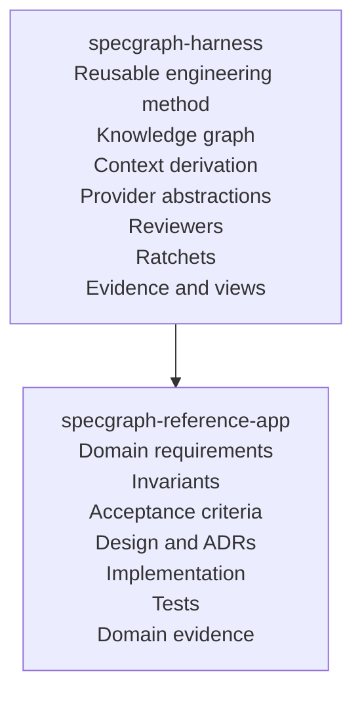
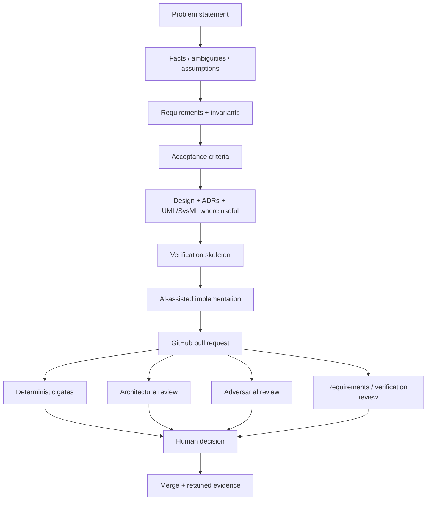
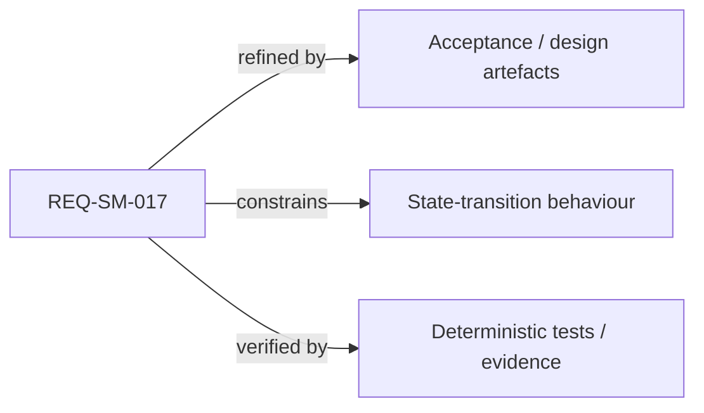

# SpecGraph Reference App

**SpecGraph Reference App is a realistic consumer application used to demonstrate SpecGraph Harness end to end on a concrete software problem.**

The application owns the domain-specific requirements, invariants, acceptance criteria, design, implementation, tests, and evidence. SpecGraph Harness supplies the reusable engineering machinery around them: knowledge-graph construction, traceability, bounded agent context, provider-neutral AI execution, review orchestration, deterministic ratchets, and generated human-readable views.

> SpecGraph Harness defines the engineering method. SpecGraph Reference App proves it on a real system.

## Purpose

This repository exists to answer a practical question:

> Can specification-driven AI-assisted development produce software that remains understandable, reviewable, auditable, maintainable, and transferable to humans?

The reference application is intentionally realistic enough to exercise the full method rather than acting as a toy wrapper around the harness.

## Relationship to SpecGraph Harness

The dependency points in one direction: this application may consume the harness, but the harness must never learn employer-specific or domain-specific concepts from this repository.

## What belongs here

The reference application is the authoritative home for concrete problem knowledge such as:

- domain requirements;
- behavioural and internal invariants;
- acceptance criteria;
- assumptions and ambiguity resolutions;
- application design;
- domain ADRs;
- UML or SysML behavioural/system models where useful;
- source code;
- unit, behavioural, integration, and acceptance tests;
- challenge- or application-specific configuration and evidence.

A specification may constrain internal behaviour, not only public interfaces. For example, a forbidden conjunction controlling a state-machine transition is a legitimate first-class invariant when it matters to correctness.

## What does not belong here

Reusable engineering infrastructure belongs in `specgraph-harness`, including:

- generic knowledge-graph semantics;
- code-graph adapters;
- agent-provider ports;
- reviewer-role abstractions;
- GitHub review publication;
- deterministic traceability/architecture ratchets;
- generic documentation generation;
- provider cost and usage accounting.

If a mechanism is useful independently of this application's domain, it should normally move into the harness rather than becoming application-specific infrastructure.

## Intended development flow

The reference application is expected to exercise a workflow broadly shaped like this:

The business solution should remain as simple as the problem permits. Methodological sophistication is valuable only when it improves correctness, traceability, maintainability, reviewability, or cost.

## Knowledge and traceability

The application is expected to expose relationships such as:

Generated matrices and diagrams are views over authoritative sources. They should not become manually maintained duplicate truths.

For simple flow, dependency, topology, and conceptual views, use GitHub-native Mermaid. For UML diagram families where UML semantics improve precision or readability, use PlantUML and keep the `.puml` source authoritative; rendered SVG/HTML/PDF artefacts remain generated views.

The resulting evidence should make practical questions cheap to answer:

- Why does this behaviour exist?
- What requirement or invariant constrains it?
- What changed?
- What else can the change affect?
- Which tests or analyses verify it?
- Which architectural decision explains the design?
- Who challenged the change?
- What evidence justified acceptance?

## AI usage

This repository should demonstrate provider-neutral AI-assisted development rather than dependence on one vendor.

Agent roles may include implementation, architecture review, adversarial review, and requirements/verification review. Providers can be selected or substituted based on capability, confidentiality, availability, and cost.

Mechanically checkable claims should remain deterministic. AI review supplies challenge and additional evidence, not final authority.

## Privacy, hiring exercises, and sanitisation

The durable identity of this repository is independent from any employer or hiring exercise.

If the application is temporarily used to implement a private challenge:

- proprietary source documents should not be committed automatically;
- employer names should not become package, namespace, or core domain identities unless genuinely required by the domain;
- challenge-specific material should remain isolated and removable;
- confidentiality and permitted AI-provider rules must be checked before external model use;
- reusable mechanisms discovered during the exercise should be classified and moved to `specgraph-harness` through separate reviewable work.

A future portfolio version should be publishable as a generic reference application without rewriting the harness or depending on confidential history.

## Current status

The repository is in bootstrap stage. Issue #1 defines the initial project-purpose and sanitisation boundary. Domain implementation will start only once a concrete problem statement exists and its confidentiality/usage constraints are understood.

Until then, the repository should avoid speculative application architecture. The reference system should be derived from an actual problem rather than reverse-engineering an impressive-looking solution in search of one.
