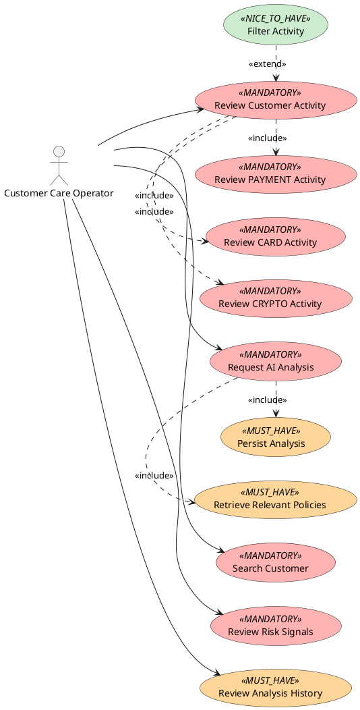

# Customer Activity Analytics — Inception

**Step:** 0 — inception before normative specification and design  
**Document role:** challenge-specific engineering rationale and delivery blueprint  
**Authority:** reference rationale only; the SRS, SDD, ADRs, tests, code, and GitHub-native metadata remain authoritative for their own semantics  
**Timebox:** five implementation days  
**Source:** the supplied Customer Activity Analytics take-home statement and database schema, retained outside the durable generic repository layer

## 1. Purpose

This document records the engineering reasoning used to turn the take-home statement into a five-day, specification-driven delivery strategy before detailed requirements, design, verification artefacts, and implementation work are instantiated.

It is deliberately **step zero**. It explains how the work should unfold, which risks should be retired first, how stubs allow early end-to-end delivery, which mature capabilities should be reused, and which illustrative decompositions are plausible. It does not replace the normative artefacts created immediately afterwards.

The goal is not to build an impressive framework around a small exercise. The goal is to make the requested system demonstrable early, keep architectural decisions reviewable, reduce integration risk continuously, and preserve enough engineering evidence to explain how AI-assisted implementation was controlled.

The central delivery rule is:

> Build a complete but hollow application first, deploy it, then replace stub adapters concentrically until the same shell becomes the final application.

This avoids both waterfall sequencing and disposable-prototype rewrites.

## 2. How to read this document

This document contains two kinds of material:

1. **Inception constraints and principles** — intended to guide the project unless superseded by evidence or a later explicit decision.
2. **Illustrative blueprints** — concrete examples of requirements structure, UML relationships, modules, adapters, CI gates, issue/PR decomposition, dashboard composition, and test strategy. These preserve the reasoning from inception but become authoritative only if adopted by the SRS, SDD, ADRs, V&V artefacts, code, or GitHub-native work graph.

When a blueprint conflicts with a later controlled artefact, the later artefact wins within its semantic domain. The inception document should then be amended if the historical rationale itself has materially changed.

## 3. Assignment facts that shape the plan

The supplied statement requires a web dashboard for customer-care operators that can:

- search a customer by Customer ID;
- review CARD, PAYMENT, and CRYPTO activity stored in a relational database;
- provide a clear activity/risk overview;
- request an AI analysis producing a risk level, findings summary, and recommendations;
- authenticate multiple operators;
- use RAG to retrieve relevant unstructured knowledge and policies;
- persist AI analyses for later review.

The preferred stack is Java 17+, Spring Boot, Hibernate/JPA, React, and a relational database. Supporting technologies and the LLM provider are open choices, and the statement explicitly permits stubs for actual LLM calls.

The supplied schema already contains transactions, the three specialized activity tables, `risk_assessments`, and `risk_rules`. The existence of triggered assessments means the exercise does not require inventing a generic rules engine merely because `threshold_logic` exists in the schema.

Delivery requires a Git repository, a README explaining execution, architecture, main decisions, and assumptions, plus a 10–15 minute demo. It also asks for a short description of LLM choices and agent instructions.

## 4. Ambiguities to convert into explicit assumptions

The source statement leaves several details deliberately or accidentally open. They should become explicit SRS assumptions rather than silent implementation guesses:

- `customers` is referenced by foreign key but its schema is not supplied;
- no operator/authentication schema is supplied;
- no schema for persisted AI analyses is supplied;
- the exact risk-level scale and aggregation rule are unspecified;
- the policy/knowledge corpus for RAG is unspecified;
- the exact meaning of “monitor” is unspecified;
- authorization semantics beyond “different operators” are unspecified;
- no external deployment target is prescribed;
- no specific LLM provider is prescribed.

Resolve only what is needed to build and demonstrate a coherent application. Do not invent a banking platform around the exercise.

## 5. Planning model: source obligation != delivery priority

Two independent dimensions must not be conflated:

1. **Requirement origin** — explicitly requested by the assignment or derived by engineering.
2. **Delivery priority** — how early a capability must become real in the concentric implementation.

Delivery priority uses three values:

- **MANDATORY** — belongs to the first useful centre of the application; failure prevents a meaningful core demo.
- **MUST_HAVE** — required for the final credible submission but may be layered after the centre already works.
- **NICE_TO_HAVE** — useful differentiation that may be dropped without compromising the requested product.

A personal GitHub Project v2 may use one single-select field named `Delivery priority` with exactly those values. It is planning metadata, not issue lifecycle. Issue lifecycle, hierarchy, dependencies, duplicates, ownership, and PR relationships remain GitHub-native.

## 6. Illustrative functional perimeter

| Capability | Delivery priority | Source |
| --- | --- | --- |
| Search customer by Customer ID | MANDATORY | Assignment |
| Review CARD/PAYMENT/CRYPTO activity | MANDATORY | Assignment |
| Review risk signals / aggregate risk view | MANDATORY | Assignment goal + supplied risk schema |
| Request structured AI analysis | MANDATORY | Assignment; deterministic stub initially allowed |
| Authenticate different operators | MUST_HAVE | Assignment |
| Retrieve relevant policies with RAG | MUST_HAVE | Assignment |
| Persist AI analysis | MUST_HAVE | Assignment |
| Review previous analyses | MUST_HAVE | Assignment |
| Filter activity by type/date/status | NICE_TO_HAVE | Derived usability |
| Inspect enriched transaction detail | NICE_TO_HAVE | Derived usability |
| Use a live external LLM provider | NICE_TO_HAVE | Derived; assignment permits LLM stubs |
| Automatic refresh/monitoring | NICE_TO_HAVE | Derived interpretation of dashboard monitoring |

The exact requirement catalogue and acceptance criteria belong in the SRS, not here.

## 7. Illustrative non-functional perimeter

The non-functional axis should also be prioritized concentrically rather than treated as a bag of “quality requirements” deferred until the end.

| Concern | Delivery priority | Rationale |
| --- | --- | --- |
| Reproducible local execution | MANDATORY | The application must be reviewable and recoverable independently of the demo environment |
| External-LLM independence | MANDATORY | A permitted deterministic stub prevents provider availability from blocking the core demo |
| Deterministic automated verification | MANDATORY | Every increment needs trustworthy feedback before review/deployment |
| Secure operator access | MUST_HAVE | Explicit assignment capability and credible financial-services baseline |
| Hexagonal/module boundary preservation | MUST_HAVE | Keeps stub-to-real substitution honest and constrains agent-generated code |
| Persistent and resettable demo data | MUST_HAVE | Enables repeatable demos and integration tests |
| Equivalent local/remote topology | MUST_HAVE | Prevents deployment-only surprises |
| Graceful AI/provider failure | MUST_HAVE | External AI must not become an availability single point of failure |
| Health/readiness evidence | MUST_HAVE | Needed for day-one deployment validation |
| Generated implementation/API documentation | NICE_TO_HAVE | High leverage once the core is stable |
| Advanced observability | NICE_TO_HAVE | Useful but not worth displacing requested functionality |

These priorities are illustrative until the SRS adopts them.

## 8. 2TUP-style functional and non-functional views

The SRS should contain two separate PlantUML use-case views:

1. a **functional use-case diagram**;
2. a **non-functional 2TUP use-case diagram**.

Use-case bubbles carry delivery priority visually and textually so the view remains readable without colour:

- light red + `<<MANDATORY>>`;
- amber + `<<MUST_HAVE>>`;
- light green/blue + `<<NICE_TO_HAVE>>`.

Use UML `<<include>>` and `<<extend>>` only where their semantics are real. Authentication should normally be a protected-use-case precondition rather than a decorative `include` repeated from every bubble.

### 8.1 Functional UML relationship sketch

A candidate structure to validate in the SRS is:

```text
Customer Care Operator
  -> Search Customer
  -> Review Customer Activity
  -> Review Risk Signals
  -> Request AI Analysis
  -> Review Analysis History

Review Customer Activity
  <<include>> Review CARD Activity
  <<include>> Review PAYMENT Activity
  <<include>> Review CRYPTO Activity

Request AI Analysis
  <<include>> Build Analysis Context
  <<include>> Produce Risk Level
  <<include>> Produce Findings Summary
  <<include>> Produce Recommendations

Build Analysis Context
  <<include>> Retrieve Relevant Policies

Request AI Analysis
  <<include>> Persist Analysis

Filter Activity
  <<extend>> Review Customer Activity

Inspect Transaction Details
  <<extend>> Review Customer Activity

Review Analysis History
  <<extend>> Review Customer Dashboard
```

This is intentionally a semantic sketch rather than the final PlantUML source.

### 8.2 Functional PlantUML style sketch



The normative SRS may adjust actors and relationships after requirement review.

### 8.3 Non-functional 2TUP sketch

A pragmatic second use-case view can expose system qualities as explicit engineering obligations:

```text
Developer / Reviewer
  -> Reproduce System Locally                  [MANDATORY]
  -> Verify Change Deterministically           [MANDATORY]

Operator
  -> Access System Securely                    [MUST_HAVE]
  -> Receive Graceful AI Failure               [MUST_HAVE]

Operator / Reviewer
  -> Use Same Product Locally and Remotely     [MUST_HAVE]
  -> Reset Deterministic Demo Data             [MUST_HAVE]

Architecture Verification
  -> Preserve Module / Hexagonal Boundaries    [MUST_HAVE]

Operations
  -> Verify Health and Readiness               [MUST_HAVE]
  -> Inspect Advanced Telemetry                [NICE_TO_HAVE]
```

This is a 2TUP-oriented requirements view, not a claim that every NFR is a classical end-user use case.

## 9. Documents are illustrated engineering artefacts

UML is not a detached gallery. Each diagram belongs semantically to the controlled document it explains.

### 9.1 SRS minimum views

- functional 2TUP use-case diagram;
- non-functional 2TUP use-case diagram;
- concise system context where useful for scope.

### 9.2 SDD minimum views

- system/context view;
- module/component diagram;
- hexagonal architecture view;
- domain/class view where it clarifies stable concepts;
- database/schema view;
- customer-query sequence;
- AI-analysis/RAG sequence;
- deployment diagram.

PlantUML source is authoritative for UML views. Rendered SVG/HTML/PDF is generated output. Spring Modulith-generated module diagrams should complement authored design intent, not create a second manually maintained implementation model.

## 10. Controlled artefact blueprint

The following outlines preserve the expected level of detail for the fresh-context preflight. They are blueprints, not substitutes for the artefacts themselves.

### 10.1 SRS blueprint

The SRS should contain at least:

```text
SRS
├── document identity and authority
├── purpose and scope
├── source provenance
├── actors
├── assumptions and unresolved ambiguities
├── functional 2TUP use-case diagram
├── non-functional 2TUP use-case diagram
├── functional requirements
├── non-functional requirements
├── acceptance criteria
├── explicit out-of-scope
└── links to controlled design/verification artefacts
```

A compact requirement representation may use:

| Field | Purpose |
| --- | --- |
| Stable ID | Durable traceability identity |
| Origin | `ASSIGNMENT` or `DERIVED` |
| Delivery priority | `MANDATORY`, `MUST_HAVE`, or `NICE_TO_HAVE` |
| Statement | Normative requirement |
| Rationale | Only where it prevents ambiguity or records a derived reason |
| Acceptance criteria | Observable evidence expected |

Do not put GitHub issue lifecycle into requirement metadata. Requirement lifecycle and work-item lifecycle are different semantic dimensions.

### 10.2 SDD blueprint

The SDD should contain at least:

```text
SDD
├── architecture drivers
├── system context + diagram
├── module/component decomposition + diagram
├── strict hexagonal dependency rules + diagram
├── domain model + diagram where useful
├── persistence/schema design + diagram
├── REST/API design
├── customer-query sequence
├── risk projection design
├── AI analysis orchestration + sequence
├── RAG design
├── security/authentication design
├── stub-substitution strategy
├── deployment topology + diagram
├── failure modes
├── health/observability strategy
├── reuse/framework decisions
└── requirement -> design/ADR mapping
```

An SDD without diagrams is not considered complete for this exercise. The diagrams are explanatory components of the design, not decorative exports added at the end.

### 10.3 ADR blueprint

Two early decisions are independently reviewable enough to deserve separate ADR consideration.

**ADR candidate A — modular monolith, hexagonal architecture, and framework reuse boundary**

Should answer:

- why a modular monolith fits a five-day exercise better than microservices;
- why Spring Modulith is used and what it verifies;
- how hexagonal ports isolate framework/vendor concerns;
- why composition is preferred to inheritance;
- which capabilities are delegated to mature libraries;
- what would justify replacing any selected component.

**ADR candidate B — AI advisory trust boundary and replaceable analysis provider**

Should answer:

- why transaction/risk evidence remains deterministic source material;
- why the LLM is advisory rather than transactional truth;
- how RAG supplies relevant policy context;
- how structured output is validated;
- why deterministic stub and live provider share one port;
- how provider outage, quota, timeout, or malformed output degrades safely;
- what analysis provenance is persisted.

Do not create ADRs merely to narrate obvious implementation details.

### 10.4 V&V/Test Plan blueprint

The durable V&V document should define strategy and evidence obligations, not manually maintained “N tests passed” status.

It should cover:

- requirement-linked verification;
- unit tests;
- property/domain tests where useful;
- port/adapter contract tests;
- Spring Modulith/ArchUnit architecture tests;
- migration and JPA integration tests;
- Testcontainers PostgreSQL/pgvector tests;
- REST integration tests;
- frontend component tests;
- critical Playwright end-to-end flow;
- deployment smoke tests;
- health/readiness checks;
- security/auth tests;
- deterministic AI stub tests;
- structured AI-output validation tests;
- RAG retrieval tests independent of the live LLM;
- failure-path evidence;
- deterministic fixture/data reproduction.

Every normative requirement should have an identifiable verification strategy or a concrete tracked gap.

## 11. Target technical architecture

Use a **modular monolith**, not microservices.

Recommended core stack:

- Java 21 within the assignment's Java 17+ constraint;
- Spring Boot;
- Spring Modulith;
- Spring MVC;
- Spring Data JPA / Hibernate;
- Flyway;
- Spring Security;
- PostgreSQL + pgvector;
- Spring AI for provider integration, structured output, RAG, and PgVectorStore;
- React + TypeScript + MUI;
- TanStack Query;
- Testcontainers;
- springdoc-openapi;
- PlantUML;
- Docker Compose + Caddy.

Likely business modules:

- `identity`;
- `customer`;
- `risk`;
- `analysis`.

RAG is a capability behind an `analysis` output port, not a reason to manufacture another bounded context.

Within a module, preserve strict hexagonal dependency direction:

```text
domain
application
  port/in
  port/out
adapter
  in/web
  out/persistence
  out/ai
  out/knowledge
```

Prefer composition to inheritance: constructor injection, final classes/records where appropriate, interfaces for ports and genuine polymorphism, and no speculative `AbstractFooService -> FooServiceImpl` hierarchies. Framework-native persistence or provider types must not become durable domain/application contracts.

### 11.1 Illustrative module responsibility split

| Module | Owns | Does not own |
| --- | --- | --- |
| `identity` | operator identity/authentication boundary | customer business data |
| `customer` | customer lookup and activity access/projection | AI provider logic |
| `risk` | risk evidence and aggregate projection | generic rules engine unless later required |
| `analysis` | analysis use case, policy retrieval port, model port, analysis history | vendor-specific model semantics in application core |

The actual SDD may rename or refine modules if implementation evidence warrants it.

## 12. Reuse-first and restrained patterns

Minimize project-owned infrastructure code.

### 12.1 Capability-to-implementer blueprint

| Capability | Preferred mature implementation | Project-owned residue |
| --- | --- | --- |
| Web/backend framework | Spring Boot + Spring MVC | domain/use-case code |
| Module verification | Spring Modulith | explicit module boundaries/policy |
| Hexagonal checks | jMolecules and/or ArchUnit | project-specific dependency rules only |
| Persistence | Spring Data JPA/Hibernate | repository ports + mapping glue |
| Schema migration | Flyway | versioned SQL migrations |
| Authentication | Spring Security | minimal operator configuration/policy |
| AI integration | Spring AI | analysis port + prompting/domain mapping |
| Structured output | Spring AI structured output | project result type + validation policy |
| Retrieval | Spring AI RAG | retrieval policy and domain-facing port |
| Vector store | Spring AI PgVectorStore + pgvector | corpus/chunking configuration |
| Embeddings | Spring AI supported provider or local ONNX option | minimal adapter/configuration |
| Synthetic generic data | Datafaker | financial scenario generator only |
| Integration DB | Testcontainers | test fixtures/assertions |
| REST docs | springdoc-openapi | endpoint semantics |
| UI components | MUI / MUI X Community where useful | domain-specific composition |
| Server-state client | TanStack Query | query keys and domain hooks |
| Frontend tests | Vitest + React Testing Library | behavior-specific tests |
| E2E | Playwright | one critical scenario first |
| Deployment | Docker Compose + Caddy | small scripts/configuration |
| UML | PlantUML | authored design diagrams |
| Implementation module docs | Spring Modulith Documenter | generated views only |

Adopt extra dependencies only when they remove real project-owned complexity. For example, MapStruct is useful if mapping volume justifies it; it is not a badge to collect on day one.

Use GoF patterns where the design naturally requires them:

- **Adapter** for infrastructure implementations behind ports;
- **Strategy** for interchangeable stub/live providers;
- **Facade/application service** for analysis orchestration.

Do not turn the exercise into pattern bingo.

## 13. Composition-first Java rules

The default implementation style should reinforce substitutability rather than class hierarchy depth:

```text
constructor injection
final classes / records where appropriate
interfaces at architectural seams
small composed services
framework adapters around application-owned ports
no speculative abstract service hierarchy
no JPA entity as public domain/application contract
no provider SDK type in durable application interfaces
```

Inheritance remains legitimate where the language/framework truly needs it, but it is not the default reuse mechanism.

## 14. Stubs are production-boundary substitutes

A stub is an implementation of the same stable port that a later real adapter will implement. It is not a throwaway parallel architecture.

Examples:

```text
AnalysisModelPort
  -> DeterministicAnalysisStub
  -> SpringAiAnalysisAdapter

PolicyKnowledgePort
  -> StaticPolicyAdapter
  -> PgVectorPolicyAdapter

CustomerActivityPort
  -> SyntheticActivityAdapter
  -> JpaCustomerActivityAdapter
```

The deterministic AI stub should consume real activity/risk context and return the final structured result shape, for example:

```text
riskLevel
summary
findings[]
recommendations[]
```

Keep the stub available in the final repository as an offline/demo fallback. The assignment explicitly allows it, and a recruiter demo should not become hostage to an external quota or credential.

### 14.1 Concentric substitution matrix

| Port/capability | R0 | Intermediate | Final/credible submission |
| --- | --- | --- | --- |
| Customer activity | hard-coded or tiny fixture stub | deterministic scenario adapter | JPA/PostgreSQL adapter |
| Risk evidence | stub projection | seeded synthetic assessments | persisted supplied-schema assessments |
| Policy retrieval | static fixture | real corpus/chunking path | pgvector retrieval |
| Analysis model | deterministic stub | deterministic stub over real context/RAG | optional live Spring AI provider, stub retained |
| Identity | temporary protected demo boundary | Spring Security in-memory/JDBC path | persisted multi-operator auth |
| Deployment | local Compose + live shell | same topology with real DB | same topology, hardened config |

The shell, ports, and topology should remain stable while implementations become progressively real.

### 14.2 AI/RAG sequence of proof

Prefer three independently debuggable states:

```text
StaticPolicyAdapter + DeterministicAnalysisStub
                      |
                      v
PgVectorPolicyAdapter + DeterministicAnalysisStub
                      |
                      v
PgVectorPolicyAdapter + SpringAiAnalysisAdapter
```

This prevents retrieval bugs from being confused with model stochasticity or provider failures.

## 15. Synthetic data strategy

Create approximately 5–8 deterministic demo customers with coherent temporal stories rather than independent uniform random rows.

Representative profiles:

- stable low risk;
- progressively growing cross-border activity;
- sudden cryptocurrency burst;
- card failures/reversals burst;
- high-value wire transfer;
- mixed anomalous behaviour.

Use Datafaker for generic identities, accounts, merchants, and descriptors. Keep the project-specific temporal generator small: baseline distributions plus a lightweight random walk or mean-reverting evolution and explicit injected shocks.

A simple family of generated signals is sufficient, for example:

```text
x[t+1] = mu + phi * (x[t] - mu) + sigma * epsilon[t] + injected_shock[t]
```

or, when even mean reversion is unnecessary:

```text
x[t+1] = x[t] + sigma * epsilon[t] + injected_shock[t]
```

The objective is not quantitative-finance realism. It is to create visually and semantically coherent histories from which risk findings and AI explanations can be understood.

Use a fixed seed so the same repository revision and seed produce the same demo customers, graphs, risk evidence, and tests. Seed `risk_assessments` coherently with the scenarios instead of building an unnecessary generic rules engine.

## 16. Risk handling without an invented rules engine

The supplied `risk_assessments` table already represents triggered transaction-level risk evidence and includes score contribution. The exercise asks the application to analyze and display risk, not to create an arbitrary expression language for `risk_rules.threshold_logic`.

Therefore the default design is:

```text
persisted risk assessments
  -> query/project
  -> aggregate/explain
  -> dashboard evidence
  -> AI analysis context
```

Do not introduce Drools, untrusted expression evaluation, a custom DSL, or equivalent machinery unless a later normative requirement explicitly demands rule execution.

`risk_rules.threshold_logic` can remain auditable explanatory metadata for seeded rules/scenarios if needed.

## 17. Demonstration UX blueprint

The UI should optimize a 10–15 minute operator/demo flow rather than maximize screen count.

A strong single-customer dashboard can contain:

```text
Header / operator identity

Customer ID search

KPI row
  - total/recent activity
  - CARD / PAYMENT / CRYPTO distribution
  - risk score / signal count
  - last analysis risk level

Activity area
  - activity-over-time chart
  - type/status distribution
  - transaction table
  - type-specific details where useful

Risk Signals panel
  - triggered assessments
  - contributions / explanations

Primary action
  - Analyze Customer Activity

AI Analysis card
  - risk level
  - findings summary
  - recommendations
  - policy references/provenance
  - timestamp/operator

Analysis History
```

The exact layout belongs to implementation/design review, but the demo should make the requested capabilities obvious without navigating a maze of pages.

## 18. Concentric delivery rings

### R0 — Hollow mock-up and architecture proof

Build the real shell immediately:

```text
Browser
  -> Caddy / HTTPS
  -> React
  -> Spring Boot
  -> application ports
  -> stub adapters
  -> PostgreSQL/pgvector container present but minimally used
```

R0 already has real frontend/backend routing, DTOs, ports, module boundaries, Compose topology, health endpoints, and deployment. Fake customer activity, risk, and analysis make the complete user journey visible.

Deploy R0 to the VPS on day 1. Expose the deployed Git SHA through application info or the UI. If application authentication is not yet ready, temporary infrastructure-level demo protection may be used and then replaced.

R0 is the application, not a disposable prototype.

The intended evolution is:

```text
R0: real shell + real topology + real interfaces + fake adapters
R1: same shell + same topology + same interfaces + fewer fake adapters
R2: same shell + same topology + same interfaces + real persistence/identity
R3: same shell + same topology + same interfaces + real risk/analysis flow
R4: same shell + same topology + same interfaces + real retrieval
R5: same shell + same topology + same interfaces + optional live provider/hardening
```

### R1 — Real read path through synthetic domain data

Replace the customer/activity stub with the deterministic synthetic adapter. Customer ID search and CARD/PAYMENT/CRYPTO activity become behaviorally meaningful. Add unit/contract/UI tests, minimal OpenAPI, and module-boundary checks.

### R2 — Real persistence and operator identity

Introduce Flyway, JPA/Hibernate, PostgreSQL persistence, deterministic database seeding, and Testcontainers. Replace synthetic storage behind the same port. Implement Spring Security/operator persistence on its own independent path where possible. Add schema validation, health/readiness, secret handling, and deterministic demo reset.

### R3 — Risk + end-to-end AI analysis with deterministic model stub

Use supplied `risk_assessments` as risk evidence, aggregate it into the dashboard, and connect the real analysis orchestration to `DeterministicAnalysisStub`. Persist results and expose history. At this point the core demo works end to end without a network LLM.

### R4 — Real RAG independently of the LLM provider

Replace static policy lookup with document ingestion, embeddings, pgvector storage, and actual retrieval while keeping the deterministic AI adapter. Prove retrieval correctness independently from provider behavior.

Then, if healthy, replace only `AnalysisModelPort` with the Spring AI external-provider adapter.

### R5 — Live provider hardening and optional polish

Exercise provider failures, structured-output validation, timeouts, fallback behavior, and remaining UX improvements. Only after all required delivery obligations are green may optional filters, richer charts, citations, broader E2E coverage, or automated CD consume time.

## 19. Deployment is an early continuous test

Maintain two supported paths:

1. local fallback: `docker compose up --build`;
2. live demo: HTTPS on one small Linux VPS.

Target topology:

```text
Internet
  |
DNS
  |
HTTPS
  |
Caddy
  |-------------------------|
React static content       /api/*
                            |
                       Spring Boot
                            |
                    PostgreSQL + pgvector
```

Do not expose the database port publicly. Keep provider secrets outside Git. Provide deterministic demo-data reset. Prefer a simple known-good deployment script taking an exact Git SHA before automating the same procedure through CI/CD.

Useful operational scripts may be:

```text
ops/deploy-demo.sh <git-sha>
ops/reset-demo-data.sh
```

Expose the deployed Git SHA through `/actuator/info`, a footer, or equivalent observable metadata.

After each meaningful ring:

```text
reviewable exact head
  -> deterministic checks
  -> deploy
  -> external smoke test
```

The first reference-app GitHub Actions bootstrap attempt failed before any job step executed. Runner availability must therefore be proven in R0 rather than assumed. The native GitHub work graph tracks that operational capability; do not encode its changing lifecycle in this document.

## 20. CI and documentation pipeline blueprint

CI begins with R0 and grows with the application. A plausible end-state gate pipeline is:

```text
backend
  -> compile
  -> formatting/static quality
  -> unit tests
  -> Spring Modulith / ArchUnit architecture checks
  -> integration tests with Testcontainers PostgreSQL/pgvector
  -> migration/startup validation

frontend
  -> npm ci
  -> ESLint
  -> TypeScript strict check
  -> Vitest / React Testing Library
  -> production build

documentation
  -> render PlantUML
  -> generate implementation module views where useful
  -> check generated artefact freshness where mechanically reliable

system
  -> docker compose build
  -> service health/readiness smoke
  -> critical Playwright scenario once the vertical path exists
```

Likely concrete quality tools include Checkstyle or equivalent Java static checks, Spotless or equivalent deterministic formatting, ESLint, TypeScript strict mode, and the test tools listed above. Select the smallest coherent set rather than collecting overlapping linters.

Do not impose an arbitrary code-coverage percentage merely because it produces a number. The stronger acceptance condition is that every normative requirement has identifiable evidence and critical boundaries/failure paths are exercised.

## 21. Authored intention vs generated implementation views

Use both, but never confuse their authority:

```text
Authored PlantUML
  -> intended use cases
  -> intended architecture
  -> intended sequences
  -> intended deployment

Generated views
  -> actual Spring Modulith/module structure
  -> OpenAPI surface
  -> current test/execution evidence
```

The useful comparison is between intended design and generated implementation evidence. Maintaining two hand-edited architecture descriptions would merely create two places to be wrong.

## 22. GitHub issues and pull requests

Issues and PRs are complementary:

- an issue owns a durable, independently reviewable capability, decision, defect, or discovery;
- a PR owns one concrete reviewable change and its proving tests;
- native GitHub parent/sub-issue, dependency, duplicate, lifecycle, assignee, milestone, and Development/closing semantics represent the work graph;
- labels are non-exclusive semantic tags, never workflow enums;
- stacked PRs are encouraged where dependency topology makes them useful.

Useful semantic labels may include `architecture`, `backend`, `frontend`, `database`, `data-generation`, `security`, `ai`, `rag`, `deployment`, `testing`, `documentation`, `observability`, `bug`, and `enhancement`.

Likely capability umbrellas include technical hollow mock-up, customer activity, operator identity, risk overview, AI analysis, and RAG. Their exact native work graph is intentionally deferred until the SRS/SDD/V&V preflight establishes authoritative scope.

## 23. Illustrative capability work graph

The fresh-context preflight may converge on a structure broadly resembling:

```text
Customer Activity Analytics delivery
├── Technical hollow mock-up
│   ├── backend shell
│   ├── frontend shell
│   └── Compose/Caddy/VPS path
├── Customer activity
│   ├── activity domain/ports
│   ├── deterministic synthetic scenarios
│   ├── activity API/UI
│   └── persistence adapter
├── Operator identity
│   └── Spring Security/operator persistence
├── Risk overview
│   ├── risk evidence projection
│   └── dashboard presentation
├── AI analysis
│   ├── analysis contract/orchestration
│   ├── deterministic model adapter
│   ├── persistence/history
│   └── optional live provider adapter
└── RAG
    ├── policy corpus/ingestion
    └── pgvector retrieval adapter
```

This diagram is illustrative only. If adopted, hierarchy and dependencies must exist as GitHub-native relations rather than prose declarations.

## 24. Illustrative PR topology

A plausible decomposition, subject to the actual SRS/SDD and independent-rejection test, is:

```text
PR01  docs: establish SRS baseline and 2TUP UML
PR02  docs: establish SDD/ADR baseline and design UML
PR03  test: establish V&V skeleton and architecture gates
PR04  build: establish Spring/React hollow shell
PR05  ops: establish Compose/Caddy/live deployment path
PR06  feat: add customer/activity ports and deterministic scenarios
PR07  feat: add customer activity dashboard slice
PR08  data: add Flyway/JPA/PostgreSQL persistence and seeded scenarios
PR09  feat: add risk projection and dashboard evidence
PR10  feat: add analysis orchestration and deterministic AI adapter
PR11  feat: persist and review analysis history
PR12  feat: add real RAG ingestion/retrieval with pgvector
PR13  feat: add multi-operator Spring Security path
PR14  feat: add optional live LLM adapter and provider hardening
```

This is an example, not a queue. Some nodes can be parallel/stacked, and some may split or collapse after design review.

Tests proving each behavior belong in the same PR that introduces that behavior. Do not create a final “testing PR” that retroactively tries to prove the entire application.

## 25. Stacked PR behavior

Use stacked PRs to maintain momentum while preserving reviewability:

```text
SRS baseline
  -> SDD baseline
    -> V&V skeleton
      -> backend shell
        -> frontend shell
          -> deployment shell
```

This does not imply waiting for every parent merge before beginning dependent work. Reviews can run while the next small branch is stacked on top.

Before a PR is integrated into `main`, reconcile its final base, native Development/closing ownership, exact-head checks, and review threads. Do not encode stack state in titles or bodies as a substitute for GitHub metadata.

## 26. Review is continuous

Route review according to the change:

| Change | Primary review focus |
| --- | --- |
| SRS / assumptions | requirements + adversarial |
| SDD / ADR | architecture |
| hollow mock-up | architecture + operations |
| schema / persistence | architecture + verification |
| security | adversarial |
| risk behavior | requirements + verification |
| AI / RAG | adversarial + architecture |
| tests | verification |
| integrated delivery | cross-system consolidation |

Continue dependent work in stacks while parent review is active. Day 5 includes consolidation review, not the first serious review of the system. Formatting and lint belong to deterministic tools, not expensive AI reviewer attention.

A reviewer finding that is independently reviewable work should become or map to a real GitHub issue. A correction that clearly belongs to the current PR is fixed there. Native duplicate/dependency/PR relations remain the work authority.

## 27. Five-day execution envelope

| Day | Main objective | Required visible state by evening |
| --- | --- | --- |
| J1 | Work-graph/artifact preflight, SRS/SDD/V&V baseline, R0, first read slice | Live HTTPS URL; complete architecture shell; customer activity visible through stubs/synthetic data |
| J2 | Persistence, deterministic data, identity, risk | Real database; multiple operators; meaningful activity/risk dashboard |
| J3 | Structured AI stub, persistence/history, real RAG | Every explicitly requested final capability demonstrable without an external LLM dependency |
| J4 | Optional live provider, failure paths, test/architecture hardening, UX | Complete robust product; only optional work remains |
| J5 | Freeze, consolidation reviews, README/evidence, demo rehearsal | Exact deployed SHA ready for a practiced 10–15 minute demonstration |

Daily invariant:

> The currently deployed SHA must support a coherent demonstration of everything already claimed complete.

## 28. Demo path blueprint

A 10–15 minute rehearsal should roughly permit:

```text
1 min   problem and scope
2 min   inception/spec-driven method and work graph
5 min   live product walkthrough
2 min   architecture, stubs, RAG/AI trust boundary
2 min   tests/CI/deployment evidence
1–2 min assumptions, tradeoffs, what was intentionally not built
```

The critical product path should be short enough to rehearse repeatedly:

```text
login
  -> search seeded customer
  -> inspect CARD/PAYMENT/CRYPTO activity
  -> inspect risk evidence
  -> request AI analysis
  -> inspect structured result and policy grounding
  -> inspect persisted history
```

If the live provider fails, switch to the deterministic supported adapter without changing the user workflow.

## 29. Stop rules

1. No unfinished SpecGraph Harness capability may block challenge delivery.
2. A framework integration consuming roughly 60–90 minutes without vertical progress triggers reevaluation or fallback.
3. No optional feature while a required delivery obligation remains red.
4. No new feature on day 5 except correction of a blocking defect.
5. Prefer deletion, substitution, or simplification over heroic custom infrastructure.
6. Prove deployment, health, and runner/CI execution on day 1.
7. Do not implement generic infrastructure that a mature component already provides behind a clean boundary.
8. Do not finish SpecGraph in order to start the exercise.

## 30. Bounded SpecGraph usage

Use the mature engineering method:

- controlled specification/design/test authority;
- GitHub-native work graph;
- small/stacked PR discipline;
- reuse-first and hexagonal boundaries;
- bounded context supplied to implementation/review agents;
- deterministic checks before probabilistic review;
- generated PlantUML/human views;
- continuous review and retained evidence.

Do not place unfinished harness machinery on the critical path:

- no dependency on an unfinished requirements engine;
- no requirement for Java code-graph support;
- no requirement for generic reviewer orchestration;
- no unfinished harness UI/persistence;
- no runtime dependency from the Java product onto the Python harness.

The harness supplies the engineering method. The consumer repository owns the challenge-specific SRS, SDD, ADRs, implementation, tests, deployment, and evidence.

## 31. Success criterion

The desired final signal is not “a framework was built around the exercise”. It is:

> A small financial-services application can be run locally and reached on a real deployment; its behavior traces back to explicit requirements and design decisions; AI is bounded behind replaceable interfaces and grounded by real retrieval; important claims are mechanically verified where possible; the GitHub history shows incremental reviewed delivery; and the whole system can be explained clearly in 10–15 minutes.

The next step after this inception document is a fresh-context preflight: instantiate the native Customer Activity Analytics work graph, produce the controlled SRS/SDD/ADR/V&V baseline with PlantUML views, review those artefacts, and immediately start the R0 hollow mock-up stack.