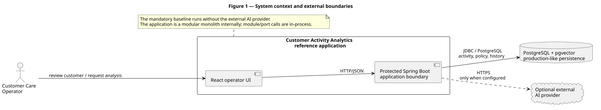
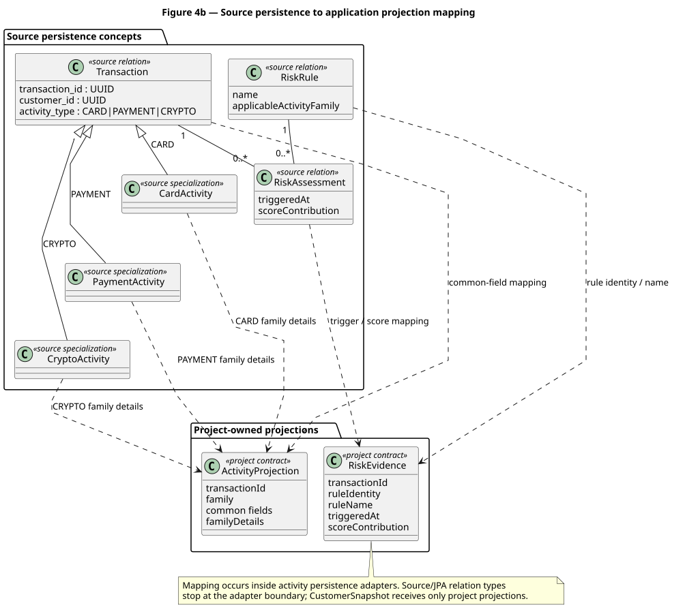
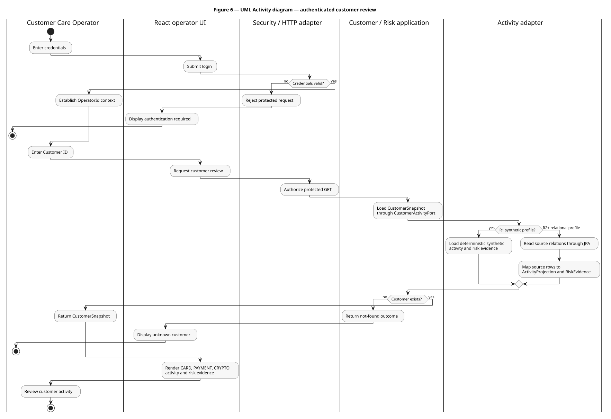
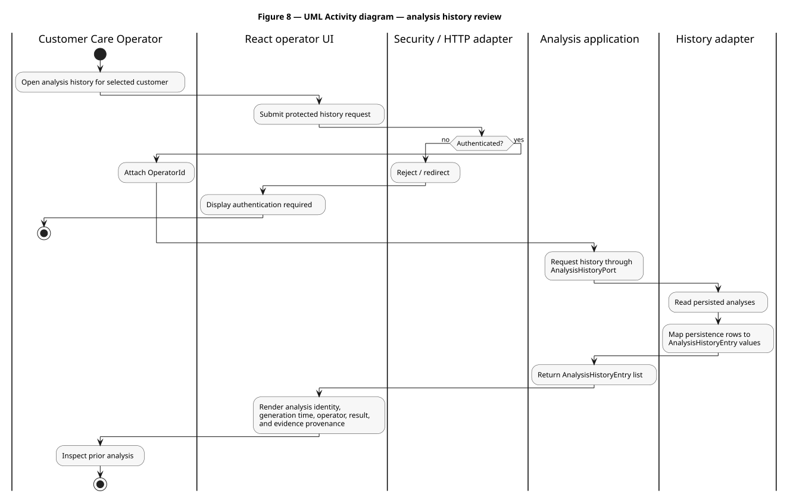
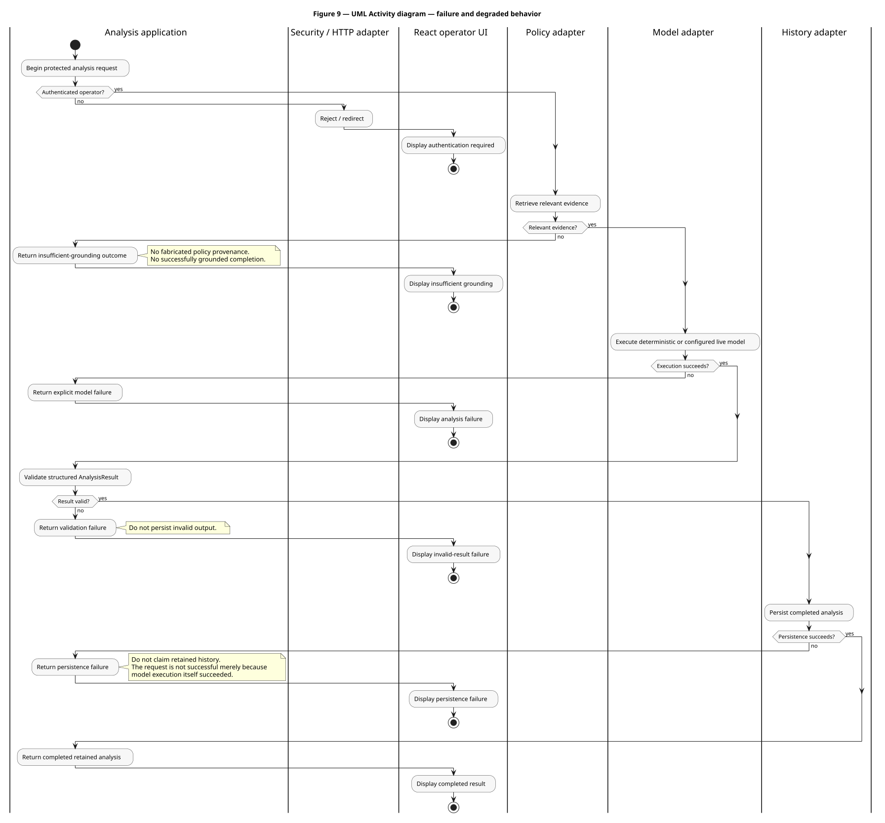
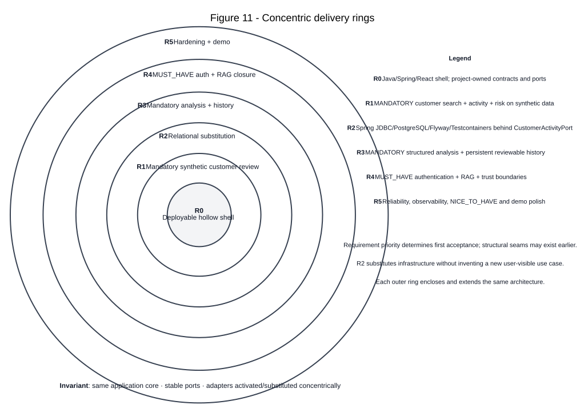

# Software Design Description (SDD) - Customer Activity Analytics

**Document ID:** `CAA-SDD-001`  
**Design map:** [`design-map.yaml`](design-map.yaml)  
**Normative requirements:** [`CAA-SRS-001`](../SRS/SRS.md)  
**Machine-readable requirements:** [`requirements.yaml`](../SRS/requirements.yaml)  
**Architecture decisions:** [`ADR-001`](../ADR/ADR-001-modular-monolith-hexagonal.md), [`ADR-002`](../ADR/ADR-002-provider-neutral-analysis.md), [`ADR-003`](../ADR/ADR-003-postgresql-pgvector-persistence.md), [`ADR-004`](../ADR/ADR-004-baseline-web-stack.md), [`ADR-005`](../ADR/ADR-005-prebuilt-demo-container-packaging.md), [`ADR-006`](../ADR/ADR-006-compose-oci-multi-platform-distribution.md), [`ADR-007`](../ADR/ADR-007-spring-jdbc-relational-adapters.md)  
**Verification strategy:** [`CAA-VV-001`](../VV/VV.md)

This document is the canonical human-readable design authority. [`design-map.yaml`](design-map.yaml) is its machine-readable requirement-to-design companion. PlantUML and Graphviz/DOT files in [`diagrams/`](diagrams/) are the semantic sources for rendered figures; SVGs are generated views, not separate design authorities.

## 1. System context and architectural orientation

Customer Activity Analytics is an operator-facing application for reviewing customer activity, source-shaped risk evidence, and analysis results. It is deliberately a modular monolith. Browser/UI, one Spring Boot application process, PostgreSQL, and an optional external AI provider are the only runtime boundaries that matter to the application architecture.

The architecture separates four concerns:

1. **Operator interaction:** React exposes customer review and analysis/history workflows.
2. **Inbound application boundary:** module-owned Spring MVC adapters expose coarse-grained use cases.
3. **Application/domain core:** project-owned contracts and ports define customer/activity, risk, detector, policy, model and history behavior independently of infrastructure.
4. **Infrastructure adapters:** synthetic/Spring-JDBC activity, no-op/Bayesian/fuzzy detector, static/pgvector policy, deterministic/live analysis and JDBC history adapters implement those ports.



**Figure 1 - system boundary and external dependencies.** The optional live AI provider is not part of mandatory execution. Internal module and port calls remain in-process.

[PlantUML source](diagrams/system-context.puml)

## 2. Authority and notation

- `CAA-SRS-001` owns normative requirements, constraints, invariants and acceptance semantics.
- `requirements.yaml` owns machine-readable requirement identity and acceptance links.
- ADRs own independently reviewable architectural decisions.
- `design-map.yaml` owns the machine-readable mapping from requirements to design elements and activation rings.
- this SDD owns the human-readable architecture and behavioral synthesis.
- implementation and executable verification own concrete behavior once activated, but cannot silently rewrite the SRS or ADR rationale.

The figures use UML 2.5.1 where it answers the engineering question and explicitly labelled non-UML schematics where topology/geometry is the point:

- Figure 1: architecture context schematic;
- Figure 2a: UML Package diagram;
- Figure 2b: hexagonal ports/adapters schematic;
- Figure 3: UML Component diagram;
- Figures 4a/4b: UML Class diagrams;
- Figure 5: entity-relationship view;
- Figures 6-9: UML Activity diagrams with ActivityPartitions;
- Figure 10: UML Deployment diagram;
- Figure 11: concentric delivery-ring schematic.

## 3. Modular-monolith structure

The backend has exactly four Spring Modulith application modules under `dev.specgraph.reference`:

- `identity`: real authenticated operator context, activated in R4;
- `risk`: project-owned source-risk contracts, active from R1;
- `customer`: customer lookup and activity-review use cases, active from R1;
- `analysis`: staged analysis orchestration, detector/policy evidence, model synthesis and analysis history, active from R3.

The current public cross-module direction required by customer review is `customer -> risk`. Analysis may use customer-facing application contracts. Reverse infrastructure dependencies are prohibited.

Spring Modulith verification ratchets the physical graph: the detected module identifiers must remain exactly `identity`, `customer`, `risk`, and `analysis`. Transport, persistence or generic helper packages do not become fifth horizontal modules.


[PlantUML source](diagrams/package-modules.puml)

Hexagonal dependency direction remains strict. Spring MVC, Spring Security, Spring JDBC, PostgreSQL/pgvector, statistical-model libraries and provider SDKs stop at adapters. Application-owned contracts do not import them.


[PlantUML source](diagrams/hexagonal-architecture.puml)

## 4. Ports, adapters and restrained GoF pattern use

The central project-owned ports are:

| Port | Responsibility | Activated behavior |
| --- | --- | --- |
| `OperatorContextPort` | expose current operator state and require an authenticated project-owned `OperatorId` where the use case demands it | deterministic R3/default attribution; Spring Security-backed context under `r4` / `r4-auth` |
| `CustomerActivityPort` | load one complete project-owned `CustomerSnapshot` for analysis/detector/retrieval semantics | synthetic R1, Spring JDBC R2+ |
| `CustomerReviewQueryPort` | load one bounded operator-facing activity/risk page without changing complete-snapshot semantics | synthetic bounded projection R1; filtered/count/`LIMIT`/`OFFSET` Spring JDBC R2+ |
| `RiskSignalDetectorPort` | derive separately identified non-source risk signals from a `CustomerSnapshot` | typed ordered `specgraph.analysis.detectors` selection resolves `NO_OP`, Bayesian or fuzzy as one leaf or a bounded Composite; legacy detector profiles are compatibility aliases only when typed selection is absent |
| `PolicyKnowledgePort` | return project-owned `PolicyEvidence` | static deterministic evidence R3; Spring AI pgvector retrieval under the R4 profile |
| `AnalysisModelPort` | consume one project-owned `AnalysisEvidenceEnvelope` and return structured result plus model provenance | typed process selection: deterministic default or explicit OpenAI; local identity reserved until #251 |
| `AnalysisHistoryPort` | persist validated history, retain complete-list compatibility, and expose bounded page queries for operator review | in-memory baseline; Spring JDBC count/`LIMIT`/`OFFSET` R3+ |

The primary adapters are `OperatorSessionHttpAdapter`, `CustomerReviewHttpAdapter`, `AnalysisHttpAdapter`, `DeterministicOperatorContextAdapter`, `SpringSecurityOperatorContextAdapter`, `SyntheticActivityAdapter`, `JdbcCustomerActivityAdapter`, `NoOpRiskSignalDetectorAdapter`, `BayesianSequentialRiskSignalDetectorAdapter`, `FuzzyRiskSignalDetectorAdapter`, `StaticPolicyAdapter`, `PgVectorPolicyAdapter`, `DeterministicAnalysisAdapter`, `SpringAiAnalysisAdapter`, and `JdbcAnalysisHistoryAdapter`.

The inception-selected GoF roles remain intentionally limited:

- **Adapter:** translates framework/provider/storage/model APIs to project-owned ports.
- **Strategy:** represents interchangeable identity-context, activity, detector, policy or analysis-model behavior behind stable ports.
- **Factory/registry:** `RiskSignalDetectorFactory` resolves bounded ordered project-owned Stage-1 detector IDs to one leaf or a Composite, while `AnalysisBackendFactory` resolves exactly one typed `AnalysisBackendId` to the selected Stage-3 `AnalysisModelPort` strategy. Neither becomes a service locator; Spring retains bean lifecycle and dependency injection.
- **Composite:** `CompositeRiskSignalDetector` treats an ordered group of Stage-1 detector leaves through the same `RiskSignalDetectorPort`, preserving child evidence and failing the Stage-1 call if any selected child fails.
- **Facade/application service:** exposes one coarse-grained use case while hiding multi-port orchestration. `AnalysisService` owns the evidence-to-analysis chain and remains unaware of both leaf-versus-Composite Stage-1 topology and provider-specific Stage-3 selection.

Hexagonal architecture is the dependency style containing these roles; it is not itself a Strategy pattern. New patterns are not added to inflate vocabulary.


[PlantUML source](diagrams/component-topology.puml)

## 5. Project-owned contracts

Stable contracts include `CustomerSnapshot`, `CustomerReviewQuery`, `CustomerReviewPage`, activity/risk projections, the sealed `AnalysisPipelineArtifact` pivot, `RiskSignalEvidence`, `PolicyEvidence`, `AnalysisEvidenceEnvelope`, `AnalysisResult`, `AnalysisModelProvenance`, `AnalysisModelOutput`, `OperatorId`, the sealed `OperatorContext`, `AnalysisHistoryCreateCommand`, `AnalysisHistoryEntry`, `AnalysisHistoryQuery`, and `AnalysisHistoryPage`.

`OperatorContext` is the application-owned identity pivot. It is a sealed interface with exactly `Authenticated(OperatorId)` and `Unauthenticated` variants. There is no `authenticated` Boolean paired with a nullable operator identity. `OperatorContextPort.requireAuthenticated()` exhaustively maps the authenticated variant to `OperatorId` and rejects the unauthenticated variant. Spring Security `Authentication`, sessions and authorities remain adapter-local and never enter the application contracts or persisted history model.

`AnalysisPipelineArtifact` is the common application-owned pivot for derived analysis-stage artifacts crossing hexagonal adapter boundaries. It is a Java sealed interface whose permitted record variants are exactly `RiskSignalEvidence`, `PolicyEvidence`, and `AnalysisModelProvenance`. The concrete record type is the discriminant. `kind()` and `artifactIdentity()` are derived exhaustively from that concrete type; there is no mutable external tag paired with a generic payload and no design in which two or three irrelevant payload fields must be `null`. Adding a fourth artifact variant must extend the sealed hierarchy and therefore makes exhaustive pattern switches fail compilation until the new variant is handled deliberately.

The pivot standardizes the mechanics that really are common, namely artifact kind, stable artifact identity and provider-neutral metadata, while preserving variant-specific typed payloads. `RiskSignalEvidence` retains detector identity, signal identity and score; `PolicyEvidence` retains retrieved source identity and content; `AnalysisModelProvenance` retains backend and model identities. A common transport/persistence family therefore does not imply common semantic authority. Source `risk_assessments` remain source truth; detector evidence is derived; policy evidence is retrieved context; model/backend provenance describes advisory execution.

`AnalysisEvidenceEnvelope` is the application-owned bounded boundary passed to advisory analysis models. It carries exact complete-input totals (`totalActivityCount`, `totalSourceRiskCount`, `totalDetectorEvidenceCount`, `totalPolicyEvidenceCount`) separately from deterministically selected activity, source-risk, detector and policy detail collections. Its members remain strongly typed collections rather than a generic `List<AnalysisPipelineArtifact>`, so the compiler also enforces which artifact variants are legal at each stage. Provider- or library-specific context classes do not cross this boundary.

`AnalysisContextBuilder` constructs that envelope immediately before `AnalysisModelPort`. Stage 1 detection and Stage 2 policy retrieval still receive the complete `CustomerSnapshot`; bounding is a Stage-3 model-context concern. Selected source-risk facts retain their backing selected activities, orphan risk detail is excluded without falsifying the complete aggregate, detector evidence is selected by descending score with stable identity tie-breaking, and policy evidence preserves retrieval rank. The configured defaults are 25 activities, 20 source-risk facts, 8 detector artifacts and 3 policy artifacts. These limits are independent from the operator-review page sizes; provider-specific redaction, tokenization and token ceilings remain inside the provider adapter.

`AnalysisResult` is constrained to a structured risk level `LOW | MEDIUM | HIGH`, a non-empty findings summary and non-empty recommendations. `AnalysisModelOutput` couples that validated application result shape to project-owned backend/model provenance without exposing provider SDK types.

`AnalysisHistoryEntry` adds generated analysis identity, customer identity, operator attribution, generation time, structured result, policy/retrieval provenance, detector provenance and model/backend provenance. These provenance families remain separate typed fields for semantic clarity while their values participate in the same sealed `AnalysisPipelineArtifact` family. They are not flattened into one untyped metadata bag.

Persistence rows, pgvector `Document` values, Spring Security principal/authentication values, statistical-library result classes and provider response classes do not become members of these contracts. Adapters must translate them into the corresponding project-owned contract before the application core sees them.


[PlantUML source](diagrams/domain-contracts.puml)



[PlantUML source](diagrams/source-contract-mapping.puml)

## 6. Detection versus explanation trust boundary

Source `risk_assessments` are persisted source-shaped evidence. They remain distinct from derived detector evidence and generated analysis.

The R3 deterministic analysis may synthesize customer context, source risk evidence and static policy evidence, but it cannot manufacture a source risk fact. A later live LLM remains advisory explanation/synthesis, not the sole detector or authority for customer risk.

R4 activates the project-owned `RiskSignalDetectorPort` as an explicit stage in the chain. Stage-1 topology is selected through the bounded ordered `specgraph.analysis.detectors` property using project-owned IDs `NO_OP`, `BAYESIAN` and `FUZZY`. `RiskSignalDetectorFactory` resolves one selected ID directly to its leaf or resolves multiple concrete IDs to `CompositeRiskSignalDetector`, which invokes children deterministically and returns their canonical evidence in configured order. `NO_OP` remains the absent-configuration baseline and deliberately emits no additional signals. The legacy `bayesian-detector` and `fuzzy-detector` profiles remain compatibility aliases only when the typed property is absent; an explicitly empty typed list, duplicate ID, `NO_OP` mixed with concrete leaves, unknown/unregistered selection or child execution failure fails clearly rather than silently changing topology or dropping evidence. The Bayesian leaf emits transparent synthetic-demo Beta-binomial review-elevation probability evidence; the fuzzy leaf emits deterministic graded review-elevation evidence from bounded project-owned membership functions and versioned rules. Both translate only into `RiskSignalEvidence` and explicitly retain synthetic/demo limitations in provenance. Further statistical, graph and classical-ML leaves may register behind the same port when justified by data and benchmark evidence. Calibrated score fusion remains separate work owned by #254. No detector output overwrites source `risk_assessments`, and `AnalysisService` remains unaware of whether Stage 1 resolved a leaf or a Composite.

The detector stage and analysis-model stage are therefore intentionally different. A detector may estimate or rank a suspicious pattern from activity evidence; `AnalysisModelPort` receives those derived signals together with source evidence and retrieved policy context and produces bounded advisory synthesis. The OpenAI/Spring AI adapter, when explicitly selected, receives the same `AnalysisEvidenceEnvelope` as the deterministic model rather than a provider-specific side channel.

[`ADR-002`](../ADR/ADR-002-provider-neutral-analysis.md) owns this decision and compares candidate detector families.

`CON-AI-002` is a design constraint, not merely a testing convention: **the default configuration does not transmit customer/activity/policy content to an external AI provider**. External transmission requires an explicitly selected live-provider adapter and data permitted for that provider. Merely placing a provider dependency on the classpath does not activate transmission.

## 7. Relational and vector persistence

R2 activates PostgreSQL 17 behind `CustomerActivityPort` using Spring Framework `JdbcClient`. Flyway is the sole schema/migration authority. Explicit SQL maps source relations into project-owned projections; no ORM lifecycle competes with Flyway.

The source relation types include exact monetary `DECIMAL/NUMERIC`, bounded currency/status fields, booleans, country codes and timezone-free `TIMESTAMP`. The adapter verifies the schema contract against the migrated PostgreSQL schema and preserves monetary amounts as exact decimal values independent from currency.

Multi-query customer aggregate reads execute under PostgreSQL `REPEATABLE READ`, so activities and risk evidence cannot be assembled from different committed snapshots. The operator-facing `CustomerReviewQueryPort` is deliberately separate from that complete-snapshot port: `JdbcCustomerActivityAdapter` applies type/status/date filters, obtains a filtered count, reads only one stable `created_at, transaction_id` page through `LIMIT/OFFSET`, and then loads source-risk evidence only for transactions present in that page. The synthetic adapter implements the same bounded contract for compatibility, but the PostgreSQL/Testcontainers path is the high-volume scalability authority.

R3 adds project-owned `analysis_history` through Flyway and `JdbcAnalysisHistoryAdapter`. Only a validated analysis whose persistence succeeds is represented as completed retained history. Operator-facing history review is also bounded: `AnalysisHistoryQuery` defaults to 20 entries and is capped at 100, while the JDBC adapter performs a count plus descending `LIMIT/OFFSET` page query. The HTTP body remains the historical array shape for compatibility; page/total metadata is carried in response headers.

The R4 analysis-chain foundation extends each history row with separately serialized detector and model provenance. Existing pre-R4 rows receive an explicit deterministic legacy model identity during migration rather than an unreadable empty object. Policy/retrieval evidence remains in its existing provenance field; detector/model metadata does not mutate source risk tables.

The R4 profile also activates the policy vector store without changing the R3/default database contract. A dedicated Flyway R4 migration creates the PostgreSQL `vector` extension and the `policy_vector_store` table with a UUID document identity, JSON metadata and `vector(384)` embedding. The HNSW index uses cosine distance. `PgVectorStore` is configured with schema initialization disabled, so Spring AI validates and uses the table while Flyway remains the sole schema authority.

The synthetic demonstration policy corpus is loaded through Spring AI text splitting and then re-identified deterministically before insertion. `SyntheticPolicyCorpusLoader` hashes source identity, chunk index and chunk content with SHA-256 through the JDK `MessageDigest` implementation, projects the first 128 digest bits into an RFC-variant UUIDv8, and therefore gives the same chunk the same UUID on repeated loads. The owned `corpus=synthetic` snapshot is replaced inside one Spring-managed PostgreSQL transaction, so a failed embedding or insert rolls the delete back instead of exposing an empty corpus. Production R4 uses the local `all-MiniLM-L6-v2` transformer embedding adapter; integration verification substitutes only the embedding model with a deterministic network-free 384-dimensional test adapter while retaining the real Spring AI `PgVectorStore`, PostgreSQL vector extension, Flyway schema and retrieval SQL.


[PlantUML source](diagrams/relational-schema.puml)

Source `TIMESTAMP` values are wall-clock values without timezone metadata. `specgraph.source-time-zone`, exposed as `SPECGRAPH_SOURCE_TIME_ZONE`, is explicit configuration. The deterministic fixture default is UTC; host JVM/OS timezone is never guessed as source semantics.

## 8. Customer review behavior

`CustomerReviewUseCase` deliberately exposes two read semantics instead of pretending that one collection shape fits every consumer. Internal analysis-compatible callers retain `findCustomer(customerId) -> CustomerSnapshot`, which traverses the complete `CustomerActivityPort`. The operator HTTP path uses `findCustomer(customerId, CustomerReviewQuery) -> CustomerReviewPage`, which traverses `CustomerReviewQueryPort` and is bounded before data crosses the HTTP boundary. R1 uses the synthetic adapter for both semantics; R2+ uses `JdbcCustomerActivityAdapter` for both without leaking JDBC types into either project-owned contract.

The operator query defaults to 50 activities and is capped at 200. It supports project-owned activity-type, status, and creation-time filters and preserves the established deterministic `created_at, transaction_id` ordering. `CustomerReviewPage` carries total counts and previous/next semantics; source-risk evidence in the page is scoped to the transactions actually returned. The React table keeps a bounded scroll surface with a sticky header and explicit pagination/filter controls. The unfiltered first page deliberately keeps the historical `/api/customers/{id}` URL so R1/R2 compatibility evidence remains valid.

Unknown customers return an explicit not-found result rather than fabricated data. Invalid bounds or date windows fail as invalid requests rather than being silently widened.



[PlantUML source](diagrams/activity-customer-review.puml) | [Sequence view](diagrams/sequence-customer-review.svg)

## 9. Deterministic analysis baseline and R4 staged composition

R3 established the mandatory offline path:

```text
AnalysisHttpAdapter
  -> AnalysisUseCase
  -> AnalysisService
  -> CustomerActivityPort
  -> PolicyKnowledgePort
  -> AnalysisModelPort
  -> structured-result validation
  -> AnalysisHistoryPort
  -> PostgreSQL
```

The successful R3 path is complete only after history persistence succeeds. Static policy evidence remains the deterministic R3/default grounding baseline. Activating the R4 profile substitutes `PgVectorPolicyAdapter` behind the same `PolicyKnowledgePort`; it does not change the use case, model boundary or source-risk authority.

R4 preserves that behavior while making the complete evidence chain explicit and independently substitutable:

```text
AnalysisHttpAdapter
  -> OperatorContextPort.requireAuthenticated()
       -> OperatorId
  -> AnalysisUseCase
  -> AnalysisService
  -> CustomerActivityPort
       -> CustomerSnapshot
          [activities + persisted source risk evidence]
  -> RiskSignalDetectorPort
       -> RiskSignalEvidence[*] implements AnalysisPipelineArtifact
          [typed selection => one leaf or bounded Composite; default NO_OP => []]
  -> PolicyKnowledgePort
       -> PolicyEvidence[*] implements AnalysisPipelineArtifact
          [R3/default: StaticPolicyAdapter | R4: PgVectorPolicyAdapter]
  -> AnalysisContextBuilder
       [complete totals + deterministic bounded detail selection]
  -> AnalysisEvidenceEnvelope
       [exact totals | selected source facts | selected detector evidence | selected policy evidence]
  -> AnalysisModelPort
       [AnalysisBackendFactory: deterministic default | explicit OpenAI | local reserved]
       -> AnalysisModelOutput
          [validated AnalysisResult + AnalysisModelProvenance implements AnalysisPipelineArtifact]
  -> AnalysisHistoryPort
       [operator + policy/retrieval + detector + model provenance persisted separately]
  -> PostgreSQL
```

`AnalysisService` deliberately keeps the cut after both Stage 1 and Stage 2. The detector and policy ports observe the complete snapshot, then `AnalysisContextBuilder` applies the independent `specgraph.analysis.context` limits before any `AnalysisModelPort` call. The bounded envelope preserves truthful complete-input totals even when only selected details are model-visible and citable. `AnalysisGroundingValidator` validates references only against those supplied details, so omitted activity, risk, detector or policy evidence cannot be cited as though it crossed the model boundary.

`PgVectorPolicyAdapter` builds a bounded retrieval query from the newest bounded activity and source-risk windows in project-owned semantics, deliberately excluding sensitive account, PAN and wallet identifiers. Spring AI `Document` and vector-store types remain adapter-local. Retrieved chunks are translated into `PolicyEvidence` containing stable chunk identity, content and provider-neutral retrieval metadata such as corpus/revision, source document, chunk position, embedding identity and similarity score. An empty retrieval returns no evidence; the existing analysis orchestration then produces the explicit insufficient-grounding failure rather than allowing model prose to fabricate context.

This composition means RAG is one context-supply stage, not the complete AI architecture. Typed Stage-1 selection can resolve Bayesian or fuzzy individually or compose both through `CompositeRiskSignalDetector`; further statistical/classical-ML/graph leaves may register later without changing `AnalysisService`. The Composite preserves child artifacts and ordering but performs no score calibration or fusion; #254 owns any later calibrated ensemble evidence. Deterministic and OpenAI Stage-3 strategies are selected independently through `specgraph.analysis.backend`; `local` is a reserved identifier that fails closed until #251 provides its adapter. All adapters translate library/provider-native results into existing application-owned sealed record variants. Neither substitution changes the application use case or grants generated output authority over source `risk_assessments`.

`AnalysisBackendId` is the application-owned Stage-3 selection contract. Spring Boot property, command-line and environment precedence converge on `specgraph.analysis.backend`, with `SPECGRAPH_ANALYSIS_BACKEND` as its environment projection and `deterministic` as the safe default. Provider settings such as `OPENAI_API_KEY` and `OPENAI_MODEL` configure the OpenAI leaf but do not select it. `AnalysisBackendFactory` keeps adapter suppliers lazy, publishes one selected `@Primary AnalysisModelPort`, and fails startup for unknown, unavailable or reserved selections instead of silently falling back.


[PlantUML source](diagrams/activity-grounded-analysis.puml) | [Orchestration sequence](diagrams/sequence-analysis.svg) | [Adapter sequence](diagrams/sequence-analysis-adapters.svg)

R3 requires operator **attribution** in persisted provenance but deliberately does not activate authentication. Under non-R4 profiles, `DeterministicOperatorContextAdapter` supplies the project-owned `OperatorId("r3-demo-operator")` so R3 remains reproducible and backwards compatible without Spring Security becoming a mandatory dependency of the use case.

R4 and the dedicated `r4-auth` verification profile substitute `SpringSecurityOperatorContextAdapter` behind the same `OperatorContextPort`. The adapter translates Spring Security `Authentication` into `OperatorContext.Authenticated(OperatorId)` and reports `OperatorContext.Unauthenticated` otherwise. `AnalysisHttpAdapter` requests the current authenticated operator through the project-owned port; the existing `AnalysisUseCase` and `AnalysisHistoryEntry` signatures do not change.

`R4SecurityConfiguration` defines two deterministic demonstration users, `operator-alpha` and `operator-beta`, whose repository-defined demo passwords are BCrypt encoded at startup. HTTP form processing is confined to `/api/session/login`; invalid credentials return `401`. `/api/session/logout` invalidates the authenticated session. CSRF remains enabled through an HTTP-session token repository, including login, logout and state-changing analysis requests. `GET /api/session` is the public bootstrap endpoint and returns a discriminated `AUTHENTICATED` or `UNAUTHENTICATED` session view plus the current CSRF token. Static UI resources and health remain public; customer/activity/risk/analysis/history endpoints under `/api/**` require authentication.

The React client mirrors the same type discipline with `LEGACY | SECURED` runtime modes and `AUTHENTICATED | UNAUTHENTICATED` secured-session variants. In secured mode, customer search and analysis/history navigation are not rendered until authentication succeeds; logout clears customer/history query state before returning to the login view.

The `r4-auth` profile exists only to prove the real Spring Security boundary independently from pgvector and ONNX startup. It keeps the deterministic/static policy path while activating authentication. The full `r4` profile composes that same security boundary with `PgVectorPolicyAdapter`. The isolated `r4-auth-ci` workflow is verification infrastructure, not a fourth published application checkpoint: it builds the exact candidate image, runs PostgreSQL, starts the image with `SPRING_PROFILES_ACTIVE=r4-auth`, and executes `VFY-AUTH-001` across anonymous rejection, invalid login, both operators, logout and persisted per-operator history attribution.



[PlantUML source](diagrams/activity-history-review.puml) | [Sequence view](diagrams/sequence-analysis-history.svg)

## 10. Failure and degraded behavior

`NFR-RES-001` maps explicitly to the identity, analysis and detector/policy/model/history boundaries. These failure modes terminate without a false authenticated/completed/history state:

- unauthenticated access to protected capabilities;
- invalid operator credentials;
- customer not found;
- detector adapter failure;
- insufficient policy grounding;
- policy adapter failure;
- model execution failure;
- structurally invalid model output;
- persistence failure.

Authentication is fail-closed before protected application work. Anonymous API access returns `401`; invalid login does not create an authenticated operator context. CSRF remains required for authenticated state-changing requests. Analysis stage ordering is also fail-closed: a detector failure stops before policy retrieval/model execution/history persistence. Missing policy evidence means no successfully grounded model execution. Invalid structured output cannot reach history persistence. Failed persistence cannot be reported as retained history.



[PlantUML source](diagrams/activity-failure-behavior.puml) | [Grounding/auth sequence](diagrams/sequence-failure-grounding.svg) | [Model/validation sequence](diagrams/sequence-failure-model.svg) | [Persistence sequence](diagrams/sequence-failure-persistence.svg)

## 11. Deployment and communication topology

Each checkpoint packages built React assets and the Spring MVC API into one Spring Boot executable JAR. Embedded Tomcat serves both `/` and `/api/*` from one origin. Node/Vite and Maven are build-stage tools, not runtime services.


[PlantUML source](diagrams/deployment-topology.puml)

Checkpoint host ports are deliberately independent so rings can be compared without adding a reverse proxy only for presentation:

- R0: host `8080` -> container Tomcat `8080`;
- R1: host `8081` -> container Tomcat `8080`;
- R2: host `8082` -> container Tomcat `8080`, private PostgreSQL dependency;
- R3: host `8083` -> container Tomcat `8080`, same PostgreSQL infrastructure plus analysis history.
- R4 baseline: host `8084` -> the current R4 artifact with `backend=deterministic`;
- R4 external variant: host `8087` -> the same artifact with explicit `backend=openai`, only when a credential is deliberately supplied.

The repository-owned `r4-variant-*` scripts invoke `compose.r4.yaml` with a distinct Compose project per variant, so application network and PostgreSQL state remain isolated. `r4-gallery-*` exposes the deterministic baseline and optional external variant as parallel R4 configurations, not additional delivery rings. The manifest records port, ring, Compose project, Stage-3 backend, expected external-transmission mode and persistence isolation. The Linux Docker host is the canonical execution environment for this gallery.

The published Compose OCI tag `ghcr.io/jdoe-dev-159753/specgraph-reference-app-compose:demo` is a **last-known-good artifact**. It advances only after publication resolves immutable R0/R1/R2/R3/PostgreSQL image digests, binds the complete five-image set into the retained Compose identity, pulls the remote Compose artifact again and passes executable browser verification.

Accepted source checkpoints are preserved through `demo/r0`, `demo/r1`, `demo/r2` and `demo/r3`. A failed publication leaves the previous `:demo` tag untouched. Repository source state and registry publication state are therefore intentionally not conflated.

The complete J2 reviewer contract publishes R0, R1, PostgreSQL-backed R2 and deterministic analysis/history R3 side by side. J2 publication is complete before R4 work advances the source application. Focused R4 verification profiles may run additional exact-head containers in CI, but they do not become published checkpoints or alter the last-known-good Compose contract until the complete R4 ring is accepted as one coherent reviewer capability.

Communication semantics:

- browser <-> embedded Tomcat: HTTP through the host-published checkpoint port;
- embedded Tomcat <-> built React assets: same-process static-resource serving;
- React <-> Spring MVC `/api/*`: same-origin HTTP;
- R2/R3/R4 Spring Boot <-> PostgreSQL: JDBC/PostgreSQL protocol on the private runtime network;
- browser <-> Spring Security session boundary: same-origin HTTP session cookie + CSRF token for state-changing requests;
- optional Spring Boot <-> live AI provider: HTTPS only when `specgraph.analysis.backend=openai` is explicitly selected;
- module/port calls: in-process.

No event broker, Redis, separate identity service, WebSocket tier or reverse proxy is introduced without a requirement.

## 12. Concentric delivery activation



[Authoritative Graphviz/DOT source](diagrams/delivery-rings.dot)

The rings activate capability maturity while preserving the same application core:

- **R0 - deployable hollow shell:** application modules, contracts and replaceable seams; no business-flow acceptance claim.
- **R1 - mandatory synthetic customer review:** customer lookup, CARD/PAYMENT/CRYPTO and source-derived risk evidence on deterministic data.
- **R2 - relational substitution:** Spring JDBC/PostgreSQL/Flyway/Testcontainers behind `CustomerActivityPort`; no invented new operator use case.
- **R3 - mandatory deterministic analysis and reviewable history:** deterministic policy/model adapters, structured analysis, explicit failures, operator attribution and PostgreSQL-backed analysis history.
- **R4 - MUST_HAVE closure:** explicit staged detector/retrieval/model/history orchestration, pgvector-backed synthetic policy retrieval with inspectable provenance, real Spring Security multi-operator authentication, protected application capabilities and related trust boundaries; optional live provider remains behind existing ports.
- **R5 - hardening/demo:** reliability, observability, reviewer polish and NICE_TO_HAVE differentiation such as Bayesian/fuzzy detector comparison, later classical-ML detector experiments or live-provider comparison without changing established boundaries.

GitHub milestones `J1..J5` are the orthogonal delivery-timebox dimension. A day may activate more than one ring.

### Use-case package to first acceptance ring

| Capability | Delivery priority | First acceptance ring |
| --- | --- | --- |
| Search customer by ID | MANDATORY | R1 |
| Review activity and CARD/PAYMENT/CRYPTO specialization | MANDATORY | R1 |
| Review source-derived risk evidence | MANDATORY | R1 |
| Request structured deterministic analysis | MANDATORY | R3 |
| Persist and inspect deterministic analysis history with operator attribution | MUST_HAVE | R3 |
| Compose source, optional detector and policy evidence through one provider-neutral analysis envelope | MUST_HAVE | R4 |
| Retrieve real relevant policy knowledge / RAG | MUST_HAVE | R4 |
| Authenticate/authorize real operators | MUST_HAVE | R4 |

The R3 history activation supplies deterministic attribution without authentication. The R4 identity substitution now proves authenticated multi-operator attribution behind the same project-owned history contract; the final combined R4 acceptance still requires the authenticated and pgvector-grounded paths to be demonstrated together.

## 13. ADR consistency

The design remains governed by seven accepted ADRs:

1. modular monolith with hexagonal boundaries;
2. provider-neutral analysis plus detection/explanation trust boundary;
3. PostgreSQL + pgvector persistence direction;
4. Java/Spring/React baseline web stack;
5. prebuilt single-image reviewer packaging;
6. Compose OCI multi-platform distribution;
7. Spring JDBC relational adapters.

The R4 refinement does not create a parallel architecture. It activates the detector seam already anticipated by ADR-002, keeps complete source context through Stage 1 and Stage 2, and places the application-owned `AnalysisContextBuilder` immediately before Stage 3 so every `AnalysisModelPort` implementation receives one bounded project-owned evidence envelope with exact totals and selected citable details. It introduces the sealed `AnalysisPipelineArtifact` family as the typed pivot shared by detector/retrieval/model-provenance adapters, extends persisted provenance, activates pgvector-backed policy retrieval behind `PolicyKnowledgePort`, and activates Spring Security-backed operator context behind `OperatorContextPort`. The R3/default static policy and deterministic operator-context adapters remain available as deterministic baselines. Bayesian and fuzzy Stage-1 detection are implemented optional substitutions; deterministic and OpenAI Stage-3 implementations are process-selectable behind the same model port, while Random Forest/graph detector families and the local Stage-3 adapter remain later substitutions rather than being falsely claimed by the required R4 path.

## 14. Review criterion

A reviewer should be able to answer from this SDD without reconstructing PR history:

- what the system boundary and four application modules are;
- where framework/provider/storage/model-library types stop;
- which ports and adapters are stable and which ring activates them;
- how `OperatorContext` and `OperatorContextPort` keep Spring Security principals/sessions outside the application contracts while preserving persisted `OperatorId` attribution;
- why authenticated/unauthenticated state is represented as sealed variants rather than a nullable identity;
- how R4 protects `/api/**`, exposes only the session bootstrap/login plus health/static resources publicly, and retains CSRF for state-changing requests;
- why the `r4-auth` verification profile is not itself a published R4 checkpoint;
- why source risk evidence, optional derived detector signals, retrieved policy evidence and generated explanation have different authority;
- how `AnalysisPipelineArtifact` acts as a sealed tagged-union equivalent whose concrete record type is the compile-time discriminant for detector, retrieval and model/backend provenance artifacts;
- why the pivot shares mechanics without introducing nullable payload branches or erasing stage-specific types;
- how the executable chain keeps the complete `CustomerSnapshot` through `RiskSignalDetectorPort` and `PolicyKnowledgePort`, then applies `AnalysisContextBuilder -> bounded AnalysisEvidenceEnvelope` immediately before `AnalysisModelPort`;
- why exact complete-input totals remain separate from selected model-visible details, why selected source-risk facts require backing selected activities, and why operator pagination limits do not size model context;
- how the R4 profile substitutes `PgVectorPolicyAdapter` for the R3 static policy adapter without changing `PolicyKnowledgePort` or exposing Spring AI `Document` values;
- how deterministic chunk identities, Flyway-owned pgvector schema, local embeddings and Testcontainers verification make retrieval reproducible and independently testable from a live LLM;
- why an empty vector retrieval cannot be silently replaced by fabricated model context;
- why RAG is one grounding/context stage rather than the whole analysis architecture;
- how implemented Bayesian/fuzzy detectors and typed deterministic/OpenAI Stage-3 selection substitute independently behind project-owned ports;
- why credentials configure a provider leaf but never select it, and why unknown or reserved Stage-3 selections fail closed;
- why external AI transmission is opt-in and absent from default deterministic execution;
- how R2 preserves exact PostgreSQL source semantics and snapshot consistency;
- why complete `CustomerActivityPort` snapshot semantics remain separate from bounded `CustomerReviewQueryPort` operator queries, and how PostgreSQL filtering/count/`LIMIT`/`OFFSET` avoids loading an unbounded customer history;
- how customer-review pagination keeps source-risk evidence scoped to visible transactions and preserves deterministic ordering;
- how deterministic analysis is validated, persisted and reloaded with either deterministic R3 attribution or authenticated R4 attribution while operator history review remains bounded through `AnalysisHistoryQuery`/`AnalysisHistoryPage`;
- how `NFR-RES-001` prevents false authenticated/completed/history state at identity, detector, grounding, model and persistence boundaries;
- how source and last-known-good published checkpoint states differ;
- how the complete J2 publication preserves R0-R3 as independent reviewer checkpoints;
- how R0-R5 extend one architecture concentrically.
