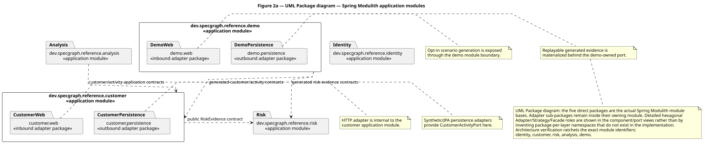
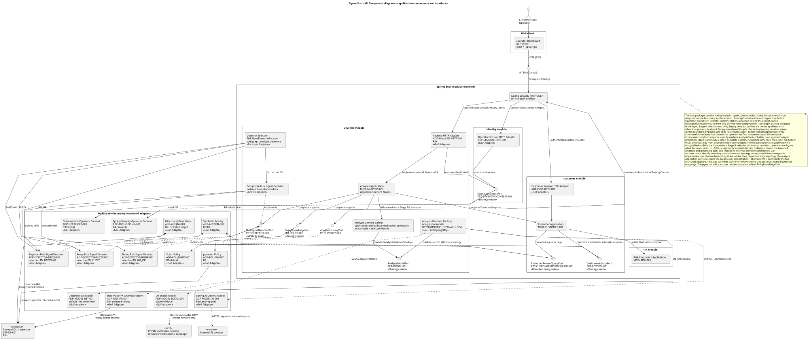
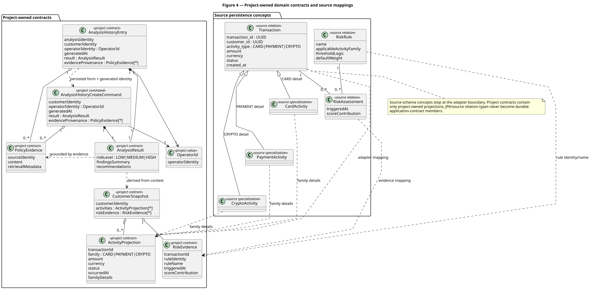
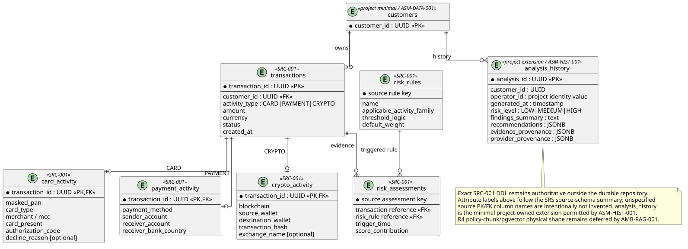
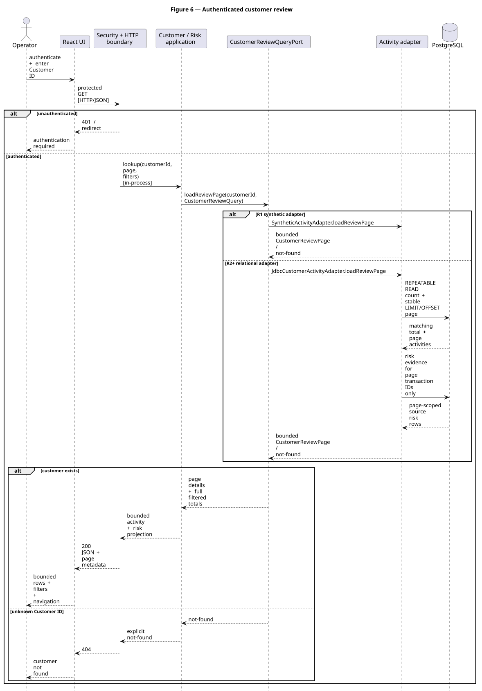
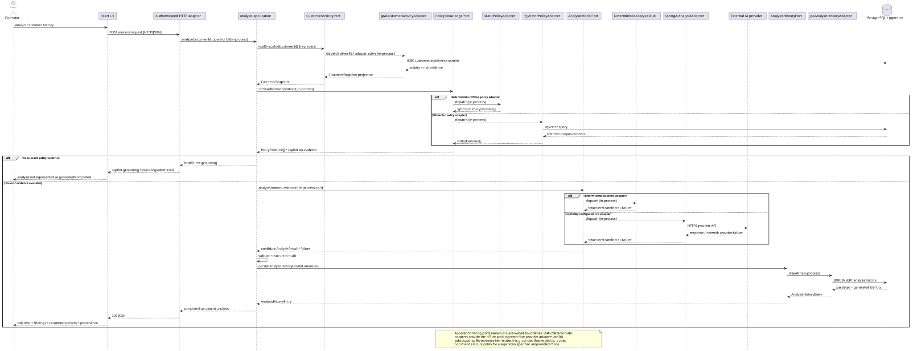
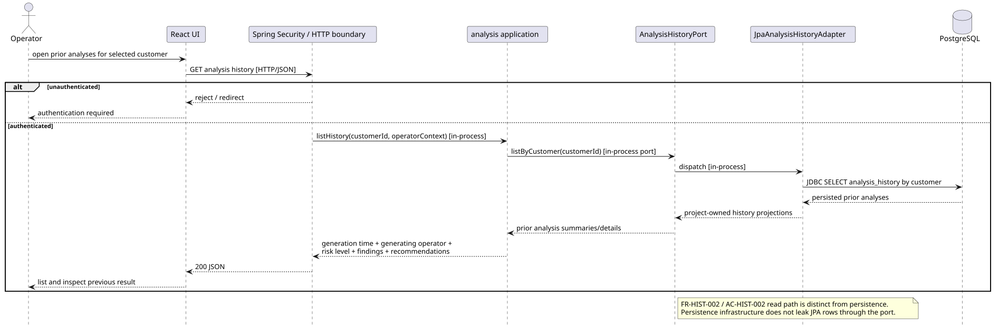
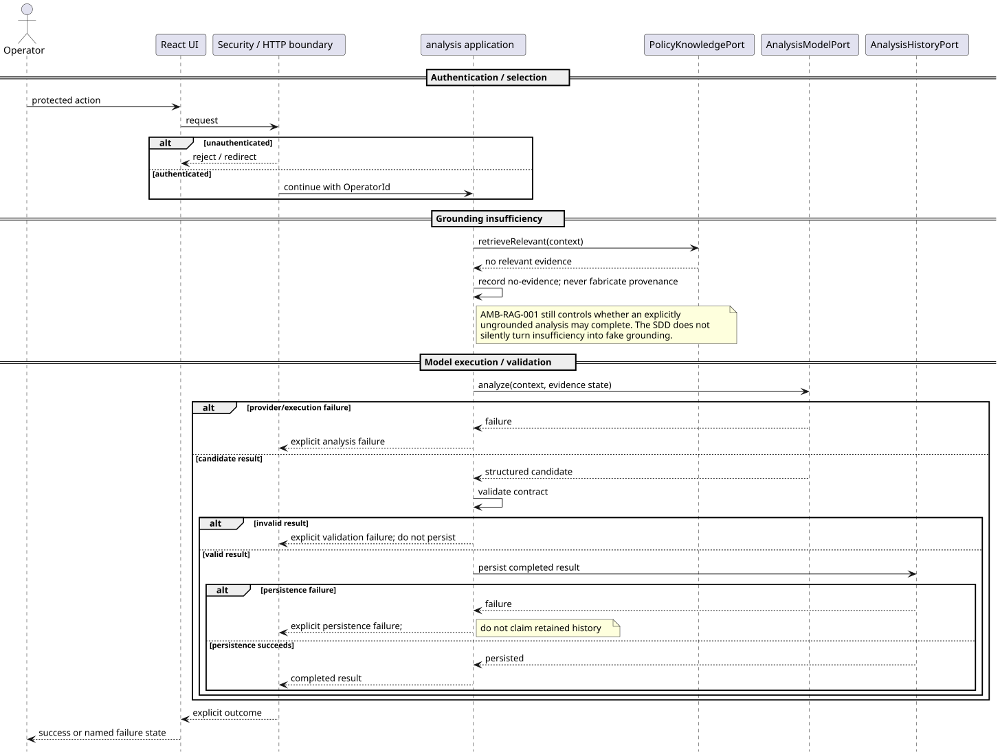
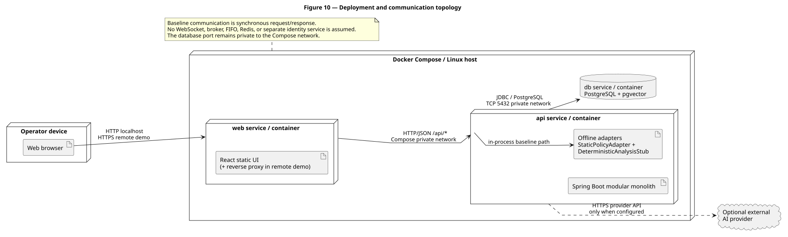

# Software Design Description (SDD) — Customer Activity Analytics

**Document ID:** `CAA-SDD-001`  
**Design map:** [`design-map.yaml`](design-map.yaml)  
**Normative requirements:** [`../SRS/SRS.md`](../SRS/SRS.md)  
**Architecture decisions:** [`../ADR/`](../ADR/)  
**Verification strategy:** `CAA-VV-001` is introduced by the dependent V&V work and is linked from this document once both authorities coexist on `main`.

This document is the canonical human-readable Software Design Description for the reference application. It is intended to be read end-to-end. `design-map.yaml` remains the machine-readable requirement-to-design mapping, while PlantUML files in `diagrams/` are the semantic diagram sources and their SVG files are generated views embedded below.

## Authority model

- `../SRS/SRS.md` owns normative requirements, invariants, assumptions and acceptance criteria.
- `../SRS/requirements.yaml` owns machine-readable requirement identity/provenance/acceptance links.
- `../ADR/ADR-*.md` own independently reviewable architecture decisions.
- `design-map.yaml` owns the current mapping from requirements to design elements, ports, adapters, ADRs and delivery rings.
- PlantUML source in `diagrams/` is semantic design source; rendered SVG is a generated view.
- implementation and executable verification become authoritative for their concrete behaviour once introduced, but do not silently rewrite requirements or ADR rationale.

If code diverges from this map, the divergence must be reconciled by changing the design artefact/ADR or the code. A stale SDD is not permitted to remain apparently authoritative merely because Markdown is patient and never complains.

## Backend shape

The backend is one Spring Boot modular monolith with four application modules: `identity`, `customer`, `risk`, and `analysis`. Hexagonal dependency direction is strict: project-owned domain/application contracts point outward only through project-owned ports; Spring MVC, Spring Security, JPA/Hibernate, PostgreSQL/pgvector and Spring AI remain adapters/infrastructure.

[PlantUML source](diagrams/package-modules.puml)

## Components and interfaces

The component view makes provided/required seams explicit. The web client requires the protected HTTP/JSON surface. Inside the backend, application modules require project-owned outbound ports (`CustomerActivityPort`, `AnalysisModelPort`, `PolicyKnowledgePort`, `AnalysisHistoryPort`); replaceable adapters provide those ports.

[PlantUML source](diagrams/component-topology.puml)

The stable application contracts are `CustomerSnapshot`, project-owned activity/risk projections, `AnalysisResult`, `PolicyEvidence`, `OperatorId`, `AnalysisHistoryCreateCommand`, and `AnalysisHistoryEntry`. The class/domain view deliberately distinguishes those contracts from source-schema concepts; source/JPA relation classes are mapped by adapters rather than becoming members of `CustomerSnapshot`.

[PlantUML source](diagrams/domain-contracts.puml)

## Relational persistence

The relational view separates source-schema facts from the narrow project-owned persistence needed by the reference application. R2 activates PostgreSQL behind `CustomerActivityPort`; R3 adds analysis history; R4 activates pgvector policy retrieval. Exact source DDL names that are not retained in the repository are not invented by the SDD.

[PlantUML source](diagrams/relational-schema.puml)

The selected relational read path is singular: `CustomerActivityPort` is implemented by `JpaCustomerActivityAdapter`, which maps source customer/activity/risk relations into project-owned `CustomerSnapshot`, `ActivityProjection`, and `RiskEvidence` contracts. The `risk` application module does not introduce a competing persistence adapter for the same source risk evidence.

## Customer review runtime

The customer-review sequence covers the authenticated operator path from React through the HTTP boundary and application contracts to either the R1 deterministic synthetic adapter or the R2+ JPA/PostgreSQL adapter. Authentication rejection and unknown-customer behavior remain explicit.

[PlantUML source](diagrams/sequence-customer-review.puml)

## Grounded analysis runtime

Analysis first loads the customer context through `CustomerActivityPort`, then obtains policy evidence behind `PolicyKnowledgePort`, runs a deterministic or configured live model behind `AnalysisModelPort`, validates the structured result, and persists through `AnalysisHistoryPort`. Local application/port dispatch remains in-process; JDBC and HTTPS appear only across their real infrastructure boundaries.

No relevant policy evidence terminates the successfully-grounded flow with an explicit insufficient-grounding result. Model/provider failure, invalid structured output, and persistence failure likewise terminate explicitly and cannot fall through into completed/retained history.

[PlantUML source](diagrams/sequence-analysis.puml)

## Analysis history review

Authenticated operators can list/inspect prior analyses through `AnalysisHistoryPort`. The read contract is `AnalysisHistoryEntry`, which carries analysis/customer identity, generating operator, generation time, structured result and evidence provenance required by `AC-HIST-002`. `AnalysisHistoryCreateCommand` is the separate write input and intentionally lacks the generated analysis identity.

[PlantUML source](diagrams/sequence-analysis-history.puml)

## Failure and degraded behavior

The focused failure view makes the negative paths independently reviewable: authentication rejection, insufficient grounding, model/provider failure, invalid structured output, and persistence failure. None of those paths may be represented as successfully completed/retained analysis.

[PlantUML source](diagrams/sequence-failure-modes.puml)

## Deployment and communication topology

The runtime remains a modular monolith, not a static box. The deployment view distinguishes browser, web/frontend service, Spring Boot API process/container, PostgreSQL/pgvector and the optional external AI provider.

[PlantUML source](diagrams/deployment-topology.puml)

Communication semantics are explicit where known:

- browser ↔ web edge: HTTP locally, HTTPS for the remote demo;
- web ↔ Spring Boot API: HTTP/JSON;
- Spring Boot ↔ PostgreSQL/pgvector: JDBC/PostgreSQL protocol over private TCP;
- Spring Boot ↔ optional external AI provider: HTTPS provider API;
- module/port interactions within the modular monolith: in-process calls.

No WebSocket, event broker, FIFO, Redis, separate identity service or other transport/process is introduced merely to make the architecture look more distributed.

## Concentric delivery activation

The design is activated through concentric rings rather than parallel throwaway architectures:

- **R0 — hollow shell:** Java/Spring/React deployment shell, application modules, project-owned contracts and replaceable ports/adapters;
- **R1 — authenticated synthetic read slice:** protected customer/activity/risk path with deterministic synthetic data;
- **R2 — relational read slice:** substitute JPA/PostgreSQL/Flyway/Testcontainers behind `CustomerActivityPort`;
- **R3 — deterministic analysis/history:** static grounding, deterministic analysis and persistent reviewable history;
- **R4 — grounded provider path:** pgvector retrieval and optional live model adapter behind the existing ports;
- **R5 — hardening/demo:** reliability, observability and demo polish without changing the established boundaries.

A later ring substitutes infrastructure behind stable seams. It does not introduce a second architecture merely because a more realistic adapter is available.

## ADR consistency

The current design remains consistent with the four accepted architecture decisions:

- **ADR-001:** modular monolith with strict hexagonal boundaries;
- **ADR-002:** provider-neutral analysis/policy ports with deterministic baseline adapters;
- **ADR-003:** PostgreSQL + pgvector as the unified production-like persistence/vector service;
- **ADR-004:** assemble the Java/Spring/React implementation from mature ecosystem components rather than reimplementing commodity infrastructure.

The contract refinements made during design review, including the split between `AnalysisHistoryCreateCommand` and `AnalysisHistoryEntry`, refine those decisions rather than introducing a new architectural decision. No synthetic ADR is added merely to record normal design elaboration.

## Review criterion

A reviewer should be able to answer from this document, without reconstructing PR diffs:

- what the static module/component boundaries are;
- which contracts and ports are application-owned;
- how source data maps into those contracts;
- how the principal successful and failure flows execute;
- where each network or persistence protocol actually occurs;
- how the deployment is composed;
- how later delivery rings replace adapters without changing the architecture;
- which accepted ADR explains each major design choice.
