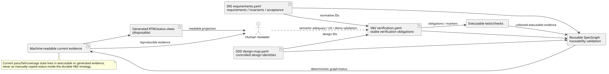

# Verification & Validation Strategy — Customer Activity Analytics

**Document ID:** `CAA-VV-001`  
**Human requirements input:** [`../SRS/SRS.md`](../SRS/SRS.md)  
**Machine requirements input:** [`../SRS/requirements.yaml`](../SRS/requirements.yaml)  
**Human design input:** [`../SDD/SDD.md`](../SDD/SDD.md)  
**Machine design input:** [`../SDD/design-map.yaml`](../SDD/design-map.yaml)  
**Architecture decisions:** [`../ADR/`](../ADR/)  
**Machine-readable verification catalogue:** [`verification.yaml`](verification.yaml)

This document is the canonical human-readable V&V strategy for the reference application. It is intended to be read end-to-end. `verification.yaml` remains the stable machine-readable obligation catalogue; executable tests and checks own current pass/fail evidence.

## 1. Authority and purpose

This document defines durable application-specific V&V policy. It does **not** record current pass counts, coverage percentages, or a hand-maintained requirement status matrix.

Authoritative layers are separated deliberately:

1. the SRS owns requirements, invariants, constraints, acceptance criteria and delivery requirements;
2. the SDD/ADRs own current design, contracts, interfaces and topology;
3. `verification.yaml` owns stable verification-obligation identity and intended evidence linkage;
4. executable tests/checks own current machine-verification evidence;
5. GitHub issues/PRs own work lifecycle and missing-verification work;
6. generated traceability/status views may summarize those authorities but do not replace them.

The reusable harness owns generic requirement/design/test graph validation. The reference app supplies domain requirements, design identities, test markers and evidence. It shall reuse the harness traceability capability and mature marker plumbing rather than invent another local traceability engine.

## 2. Verification obligations at a glance

The baseline currently defines ten stable obligations. This table is a human reading view of `verification.yaml`, not a second machine authority and not a statement that the evidence already passes.

| Obligation | Concern | Primary evidence level |
| --- | --- | --- |
| `VFY-CUSTOMER-READ-001` | Customer lookup, CARD/PAYMENT/CRYPTO activity and risk evidence on the operator dashboard, including bounded high-volume pagination/filtering | focused UI E2E + HTTP acceptance + real PostgreSQL/Testcontainers port/integration |
| `VFY-AUTH-001` | Multiple authenticated operators and protected capabilities | Spring Security integration + HTTP acceptance + focused browser E2E |
| `VFY-ANALYSIS-CONTRACT-001` | Structured result plus deterministic bounded Stage-3 context with truthful complete-input totals and citable selected evidence | contract/unit + acceptance |
| `VFY-RAG-001` | Relevant policy grounding, explicit absent-grounding behavior and provenance | port/integration + failure-path acceptance |
| `VFY-HISTORY-001` | Persisted analysis and authenticated later review with operator/time attribution, including bounded history-page semantics | PostgreSQL integration + HTTP/browser acceptance |
| `VFY-REPRODUCIBILITY-001` | Clean-checkout local/demo startup and deterministic project assembly | deployment/Compose + smoke validation |
| `VFY-DETERMINISM-001` | Mandatory baseline without a live external LLM | deterministic adapter acceptance |
| `VFY-FAILURE-PATHS-001` | Authentication, grounding, model/result and persistence failures do not masquerade as success | explicit failure-injection acceptance/integration |
| `VFY-CONFIDENTIALITY-001` | External-model transmission remains opt-in and deterministic local behavior remains available | configuration + negative integration |
| `VFY-DELIVERY-001` | Repository/README, short demo, LLM-choice summary and agent-instruction summary | artifact checks + executable demo path + focused human validation |

Exact requirement, acceptance-criterion, invariant, delivery and design IDs for each obligation remain in [`verification.yaml`](verification.yaml).

## 3. Verification levels

### Unit and property verification

Use for project-owned domain values, structured result validation, deterministic synthetic generation, specialization invariants and other logic whose contract is independent of Spring/React/PostgreSQL. Property tests are preferred where invariants range over many generated examples.

### Port and contract verification

Each stable project-owned port receives contract tests that can run against the deterministic baseline adapter and the production-like adapter. The purpose is substitution safety: changing `SyntheticActivityAdapter` to a PostgreSQL-backed adapter or deterministic analysis to a live provider must not change the application contract.

`VFY-ANALYSIS-CONTRACT-001` also verifies the model-context cut itself. High-volume fixtures prove that Stage 1 detection and Stage 2 retrieval receive all 250 activities while `AnalysisModelPort` receives at most the configured 25 activity details; complete totals remain 250. Builder tests cover the independent 25/20/8/3 defaults, deterministic selection, source-risk-to-activity backing, orphan exclusion with truthful totals, impossible-configuration rejection and grounding rejection for omitted detail. Adapter tests separately prove that complete totals and selected counts are not conflated.

### Integration verification

Use real infrastructure at boundaries where the design depends on infrastructure semantics: Spring Security, HTTP serialization, Spring JDBC/Flyway/PostgreSQL, pgvector retrieval and analysis-history persistence. Integration tests verify boundaries, not framework internals.

For R4 identity, integration evidence exercises the real Spring Security filter chain, HTTP session, BCrypt-backed local demonstration users, CSRF repository and PostgreSQL-backed analysis history. The application core remains observable through `OperatorContextPort`/`OperatorId`; tests do not replace that seam with SecurityContext-specific application contracts merely because the boundary implementation is Spring Security.

### Acceptance verification

Acceptance scenarios are derived from SRS acceptance criteria and exercise observable behavior through the highest practical public boundary. They remain distinct from implementation-specific test names.

The dashboard criteria `AC-CUST-001`, `AC-ACT-001`, `AC-ACT-002` and `AC-RISK-001` explicitly concern what an operator can select and see. `VFY-CUSTOMER-READ-001` therefore requires focused UI/E2E evidence in addition to API acceptance. A healthy API cannot by itself prove that the React route, selection action or rendering presents the required activity and risk information. API-level acceptance remains sufficient where browser rendering adds no semantic evidence.

`VFY-AUTH-001` likewise requires browser evidence because authentication changes operator-visible navigation and session state. The focused R4 auth acceptance path must demonstrate an anonymous `401`, invalid credential rejection, successful login for at least two distinct operators, protected customer/analysis navigation, logout, and distinct persisted operator attribution. The proof runs against the exact candidate application image with real PostgreSQL under the `r4-auth` verification profile. This profile isolates the authentication seam from pgvector/ONNX startup for focused verification; it is not a published R4 checkpoint and does not substitute for the later complete authenticated + grounded R4 acceptance flow.

### Architecture verification

Mechanically check dependency direction and forbidden coupling: project-owned domain/application contracts must not depend on Spring, JDBC or provider-specific types, and adapter substitution must remain possible behind the declared ports. Spring Modulith/architecture checks are executable evidence for the modular-monolith boundary, not a substitute for behavioral tests.

For bounded analysis context, architecture review also checks the placement of `AnalysisContextBuilder`: the complete `CustomerSnapshot` must reach `RiskSignalDetectorPort` and `PolicyKnowledgePort`, and only the application-owned projection immediately before `AnalysisModelPort` may bound Stage-3 details. Operator-review pagination values are not accepted as model-context limits, and provider tokenization/redaction remains adapter-local.

For identity, the architectural ratchet is the same rule applied to security: Spring Security `Authentication`, `SecurityContext`, session and authority types stay inside the security/web adapter boundary. Application analysis receives only the project-owned `OperatorId` selected through the sealed `OperatorContext`/`OperatorContextPort` contract.

### Failure-path verification

Negative behavior is first-class evidence. Authentication rejection, unknown customer, absent grounding, provider/model failure, invalid structured output and persistence failure must be exercised where their requirement/acceptance contract exists. A test suite containing only happy paths is not sufficient evidence for `NFR-RES-001`.

In particular, failure injection must demonstrate that:

- unauthenticated access cannot invoke protected customer/analysis/history capabilities;
- invalid credentials do not create authenticated operator state;
- state-changing secured requests preserve CSRF enforcement rather than disabling it to simplify the demo;
- absent relevant policy evidence is explicit and does not fabricate grounding provenance;
- source-risk detail without a backing selected activity is rejected or omitted before the model boundary, and impossible context limits fail closed;
- model/provider failure does not create a completed history entry;
- invalid structured output is rejected before persistence;
- persistence failure is surfaced and cannot be represented as retained history.

### Deterministic baseline verification

Mandatory acceptance must run without a live external LLM. The deterministic/static adapters are therefore verification infrastructure, not merely demo shortcuts. Live-provider checks, when configured, are supplemental and may never become the sole proof of mandatory behavior.

Stage-3 selection verification treats `specgraph.analysis.backend` as the single authoritative dimension. It proves the no-credential deterministic default, explicit OpenAI selection without activating unrelated model families, configuration-binding rejection of unknown values, and fail-closed `local` selection until #251 provides that adapter. Provider credentials and model settings must not select a backend implicitly. Compose/script evidence additionally checks that parallel R4 variants use distinct Compose projects, ports and PostgreSQL state and that their manifest reports the selected backend and external-transmission expectation truthfully.

The R4 `r4-auth` verification profile intentionally combines real authentication with the deterministic/static analysis path. This proves operator security without introducing either an external model dependency or an accidental requirement that the focused auth suite download an embedding model. The complete R4 acceptance later composes the same identity boundary with real pgvector retrieval.

### Delivery verification

The four source delivery requirements are part of the controlled baseline rather than administrative footnotes. `VFY-DELIVERY-001` covers them explicitly:

- `DEL-001`: verify that the repository contains the reviewer-facing README and that documented entry points resolve;
- `DEL-002`: exercise the documented short demo path from a clean/reproducible deployment and retain focused human evidence that the intended scenario is demonstrable;
- `DEL-003`: verify that the controlled reviewer material contains the LLM/provider choice summary and its rationale;
- `DEL-004`: verify that the controlled reviewer material contains the agent-instruction summary needed to understand how AI-assisted development was governed.

The executable demo path uses the same packaged Docker Compose topology as application CI. React is compiled ahead of time and embedded in the Spring Boot executable JAR; the running application container is Java 21 + Spring Boot + embedded Tomcat serving the UI and `/api/*` from one origin. Node/Vite are build-time tooling and are not part of the persistent R1 runtime.

For source-checkout development and verification, the project-owned Compose/scripts start the exact application image and wait for its healthcheck before browser acceptance runs. For reviewer distribution, the published Compose OCI artifact resolves the same checkpoint images and is started with the documented `docker compose -f oci://... up -d --wait` contract. These are distribution/entry-point variants of the same application topology, not competing runtime designs. Later rings may add mandatory services such as PostgreSQL behind that Compose contract without reintroducing a separate frontend server.

Focused R4 verification may run exact-head candidate containers outside the published Compose checkpoint set when that isolation improves fault localization, as `r4-auth-ci` does for authentication. Such a container is verification infrastructure only. It cannot be presented as a reviewer checkpoint or advance the last-known-good `:demo` contract before the complete R4 topology and its combined acceptance are ready.

Browser-reachable host names and host ports remain deployment configuration. The R0/R1 local defaults are the documented reviewer ports; a dedicated Docker-capable demonstration host may override the browser-reachable host/port through the project-owned demo configuration without changing container-internal service semantics. DNS, TLS termination, reverse proxying and router forwarding are not implicit acceptance prerequisites and require separate evidence if deliberately introduced.

Mechanical artifact checks should prove existence and resolvable references where possible. Human validation proves communicative adequacy where a Boolean file-exists check would merely certify that bytes occupy disk space.

### Human validation

A human reviewer validates concerns that automation cannot prove economically: dashboard comprehensibility, SRS/SDD/diagram intelligibility, the short demo flow, and whether the assembled evidence actually tells a coherent engineering story. Human review supplements executable evidence; it does not turn subjective approval into a substitute for deterministic checks.

## 4. Requirement and design linkage

`verification.yaml` defines stable verification-obligation IDs. An obligation is not a claim that a test already passes. It states **what evidence must exist** and which requirement/acceptance/design identities it is intended to verify.

Implementation PRs satisfy obligations by adding executable evidence carrying the stable obligation/requirement IDs. Until that happens, generated current-status views shall report the obligation as missing/pending from executable evidence. The durable strategy remains unchanged merely because a test temporarily fails or passes.

The SDD is part of the verification input rather than background decoration: tests at port, integration, architecture and deployment levels verify specific design seams such as `OperatorContextPort`, `CustomerActivityPort`, `AnalysisHistoryPort`, authenticated HTTP boundaries, Spring JDBC/PostgreSQL substitution and the Compose topology.

[PlantUML source](diagrams/verification-evidence-flow.puml)

## 5. Marker and harness integration

When the corresponding harness capability is available, pytest-side verification should evaluate/reuse `pytest-requirements` marker semantics first, consistent with `specgraph-harness#81`. SpecGraph-specific code owns only catalogue/graph consistency that a generic pytest marker plugin cannot know.

The consumer contract should be able to reject at least:

- unknown or superseded requirement IDs in test evidence;
- design references to unknown controlled design identities;
- a normative or delivery requirement with neither its required obligation/evidence nor an explicit missing-verification work item;
- stale generated status presented as authority.

The app must not implement a second generic RTM renderer or pytest marker framework merely because Python packages occasionally fail to flatter our sense of originality.

## 6. Evidence policy

Evidence should be cheap to reproduce and close to the behavior it proves:

- unit/property evidence: normal test runner output plus markers;
- HTTP/security evidence: Spring Security integration plus exact-head browser acceptance where session/navigation semantics are operator-visible;
- database evidence: migration + repository/integration tests against real PostgreSQL where semantics matter, including high-density fixtures that prove filtering/count/`LIMIT`/`OFFSET` occurs before activity/history payloads cross the operator boundary;
- architecture evidence: deterministic dependency/import/module checks;
- UI evidence: focused E2E assertions for dashboard and authentication acceptance plus human review of comprehensibility;
- provider evidence: typed factory/configuration tests, deterministic no-credential integration, bounded-envelope and confidentiality tests for the live-provider adapter, explicit OpenAI selection separately tagged, fail-closed unsupported/invalid selection, and optional live-provider smoke evidence;
- deployment evidence: clean-checkout Compose startup/readiness and the same documented browser-ready demo path locally or on the configured Docker VM;
- delivery evidence: repository artifact/link checks plus focused human validation for the demo and reviewer-facing summaries.

No manually copied pass count is authoritative. If a human-readable matrix is useful, generate it from controlled catalogues and executable evidence.

## 7. Exit criterion for this baseline

This V&V baseline is complete when:

- every normative SRS requirement has one or more stable verification obligations in `verification.yaml`;
- every SRS delivery requirement has one or more stable verification obligations;
- every SRS acceptance criterion is linked to at least one obligation;
- invariants and safety constraints that need independent verification are linked explicitly;
- dashboard and authentication acceptance criteria that require operator-visible behavior include focused UI/E2E evidence;
- obligations name the intended evidence level without pretending executable tests already exist;
- current verification status can later be derived from executable evidence rather than edited into this document;
- the strategy is understandable from `VV.md` without opening YAML merely to discover what is meant to be verified;
- the embedded verification-flow SVG is committed alongside its PlantUML source;
- no harness-generic traceability mechanism has been duplicated in the reference app.
